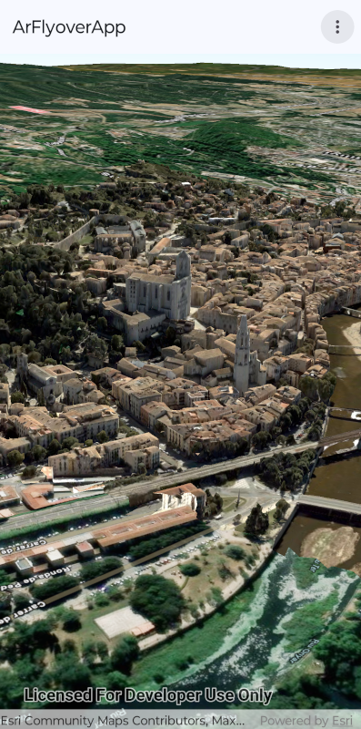

# AR Flyover Micro-app

This micro-app demonstrates the use of the `FlyoverSceneView` toolkit component to render an `ArcGISScene` containing an `IntegratedMeshLayer` with realistic textures for the city of Girona in Spain.

| Flying over the city | Selecting a new location | On the city walls |
|----------|----------|----------|
|  |  |  |

## Prerequisites

- `FlyoverSceneView` requires a device that [supports ARCore](https://developers.google.com/ar/devices).

## Usage

Launch the app and wait for the scene to load. Initially it shows an aerial view of Girona. A high translation factor value is set, allowing you to fly over the city quickly by making relatively small movements of your device.

You can use the overflow menu in the top bar to select from a list of locations within the city. All the locations, except for the initial "Flying over the city", cause a smaller translation factor value to be set. These are designed to suit exploring the scene by walking around, turning, and reorienting your device to look up and down.

A Callout is displayed when you select a location other than "Flying over the city". The Callout displays some information about the place you've selected. You can Dismiss the Callout once you've read it.

For more information on the `FlyoverSceneView` component and how it works, see [The Toolkit Augmented Reality README file](../../toolkit/ar/README.md).
