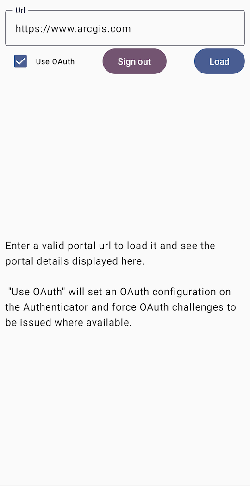

# Authentication Microapp

The Authentication Microapp demonstrates the use of the `Authenticator` component, which can also be used as a platform for experimenting with authentication related API. For more information on the `Authenticator` component and how it works, see the [Readme](../../toolkit/authentication/README.md).



## Usage

On startup, the app presents the user with a editable text field containing a portal URL. Upon pressing the "Load" button, a portal will be created and loaded. If the portal is secured, it may potentially issue an authentication challenge. 
If the portal is successfully loaded, the info screen below will display the portal info JSON, otherwise it will display the loading error. 

The "Use OAuth" checkbox controls whether the `Authenticator` will use OAuth to load the `Portal`.
The "Signout" button clears any saved credentials, if there are any Identity-Aware-Proxy (IAP) credentials, this will launch a browser page to invalidate the IAP session.

To load a different Portal URL with OAuth, the `AuthenticationAppViewModel.oAuthUserConfiguration` should be changed to match the portal's configuration. 

```kotlin
private val oAuthUserConfiguration = OAuthUserConfiguration(
	<your-url-here>,
	<your-client-id>,
	"my-ags-app://auth"
)
```


