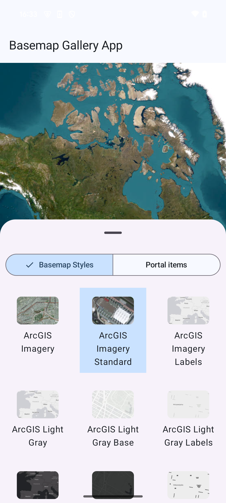

# Basemap Gallery Micro-app

This micro-app demonstrates the use of the `BasemapGallery` toolkit component which allows browsing
a selection of basemaps and setting them on the map.

## Usage

The application shows a map view and a bottom sheet containing a basemap gallery and a segmented
button for selecting to display basemaps from a style service or a Portal. Once the gallery has been
populated clicking on a basemap will set that basemap on the map in the map view.

For more information on the `BasemapGallery` component and how it works, see its [Readme](../../toolkit/basemapgallery/README.md).