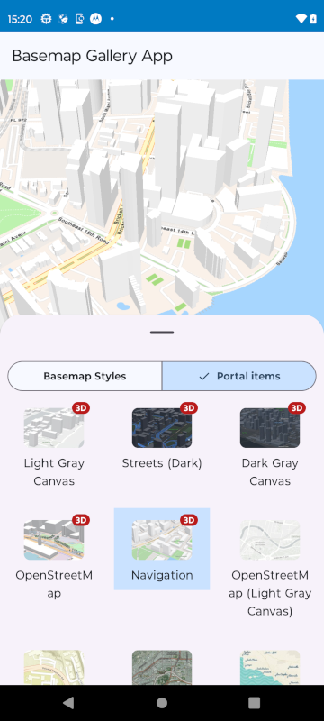

# Basemap Gallery Micro-app

This micro-app demonstrates the use of the `BasemapGallery` toolkit component which allows browsing
a selection of basemaps and setting them on a map or scene.

## Usage

The application shows a scene view and a bottom sheet containing a basemap gallery and a segmented
button for selecting to display basemaps from a Basemaps Style service or a Portal. In the case of
the Portal, 3D basemaps are highlighted using a "3D" badge. Once the gallery has been populated,
clicking on a basemap will set that basemap on the scene in the scene view.

For more information on the `BasemapGallery` component and how it works, see its [Readme](../../toolkit/basemapgallery/README.md).