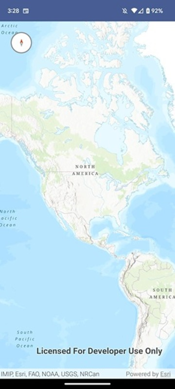

# Compass Micro-app

This micro-app demonstrates the use of the `Compass` toolkit component which displays the current viewpoint rotation of a MapView.

## Usage

The application loads with the compass set to auto hide. Rotate the map to see the compass point to North. 
To reset the orientation to North, tap on the compass icon.

For more information on the `Compass` component and how it works, see its [Readme](../../toolkit/compass/README.md).
