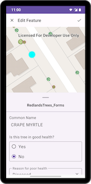
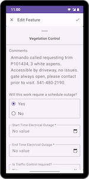

# FeatureForms Micro-app

This micro-app demonstrates the use of the [FeatureForm](../../toolkit/featureforms/README.md) toolkit component which provides a rich, dynamic, and responsive form
for editing Feature attributes.

 

## Usage

The application provides a web map gallery and a map viewer which invokes the form when Features are tapped.
Authentication is optional but limited to specific public web maps.

To login to your ArcGIS Online account, click the `Sign in with ArcGIS Online` button in the app. This will open the OAuth page in a new browser window where you can enter the account credentials. 
Once you have signed in, you can access the web maps that are shared with your account.

If you'd rather use an ArcGIS Enterprise account, click the `Sign in with ArcGIS Enterprise` button in the app. This will open a dialog prompting for an Enterprise URL followed by another dialog to enter your credentials.

For more information on the `FeatureForm` component and how it works, see its [Readme](../../toolkit/featureforms/README.md).
