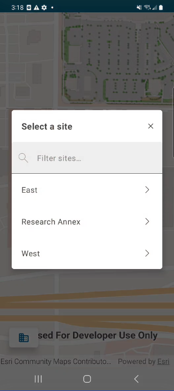
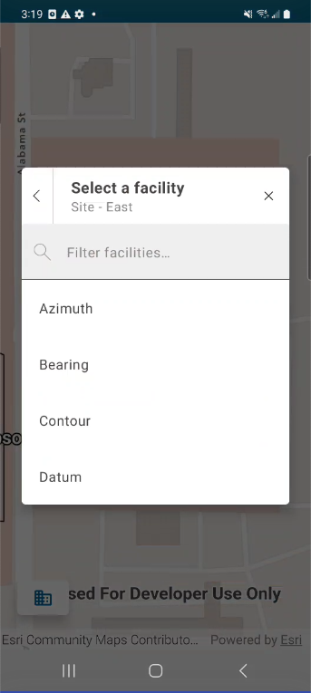
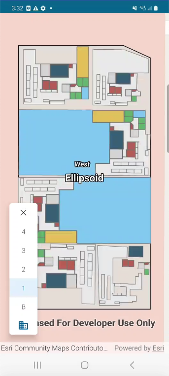
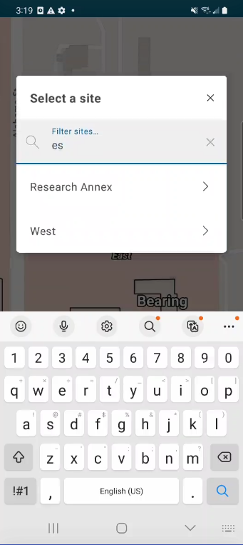
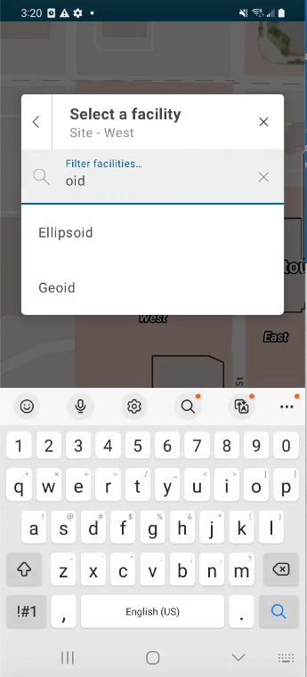

# FloorFilterApp

This micro app showcases the use of the FloorFilter toolkit component. It uses the map of a fictional corporate campus "made up" data following 
the Indoors Information Model schema and floor awareness.

When the Site button is tapped, a prompt opens so the user can select a site and then a facility. After selecting a site and facility,
a list of levels is displayed.-

|Site Button|
|:--:|
||

|Site Selector|Facility Selector|Floor Selector|
|:--:|:--:|:--:|
||||

The list of sites and facilities can be dynamically filtered using the search bar.

|Site Filter|Facility Filter|
|:--:|:--:|
|||
