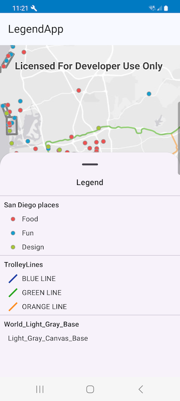

# LegendApp

This micro app showcases the use of the Legend toolkit component which conveys the meaning of the symbols used to represent features in the layer. The micro app uses a map of San Diego showing a selection of cool places to visit.

## Usage

The application loads a webmap, and the Legend toolkit component is shown in the bottom sheet. 

For more information on the `Legend` component and how it works, see its [Readme](../../toolkit/legend/README.md).
