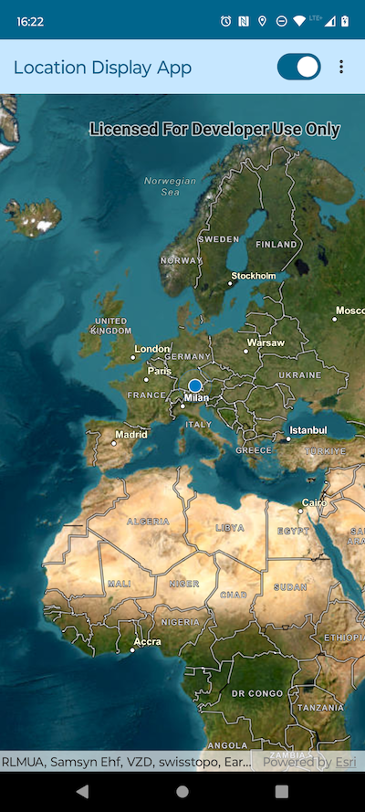

# Location Display Micro-app

This micro-app demonstrates the use of `LocationDisplay` with a composable `Map`.

## Usage

The application starts with a `LocationDisplay` set up and started. Use the switch in the app bar to start/stop the location display.
Use the overflow action button in the app bar to choose between different `LocationDisplayAutoPanMode` options.

For more information on the composable `Map` component and how it works, see it's [Readme](../../toolkit/geo-compose/README.md).
