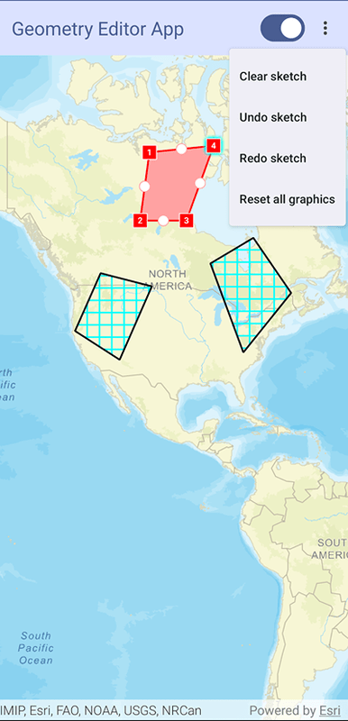

# MapView Geometry Editor Micro-app

This micro-app demonstrates the use of `GeometryEditor` and `GraphicsOverlay` with a composable `MapView`.

## Usage

The application starts with a `GeometryEditor` set up and not enabled. Use the switch in the app bar to start/stop the geometry editor session.
Use the overflow action button in the app bar to choose between different options to undo, redo, or clear all `Graphics` from the `GraphicsOverlay`.

For more information on the composable `MapView` component and how it works, see its [Readme](../../toolkit/geoview-compose/README.md).
