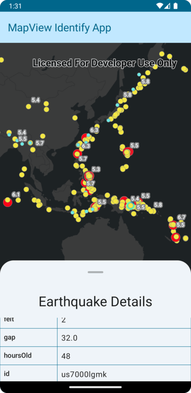

# MapView Identify Micro-app

This micro-app demonstrates the use of `MapViewProxy` to identify features with a composable `MapView`.

## Usage

The application starts with a MapView and displays a map with recent global earthquake events. A bottom sheet displays information about the last identified feature. Tap a feature in the MapView to populate the bottom sheet with information about the earthquake event at that location.

For more information on the composable `MapView` component and how it works, see its [Readme](../../toolkit/geoview-compose/README.md).

