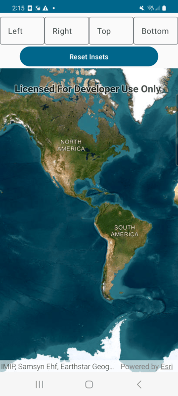

# MapView Insets Micro-app

This micro-app demonstrates the use of `Insets` with a composable `MapView`.

## Usage

The application starts with a `Map` with no insets specifed. Use the corresponding text fields to specify left, right, top or bottom insets.
The attribution bar at the bottom reacts to the inset values specified. The `Reset Insets` button resets all the insets.

For more information on the composable `MapView` component and how it works, see its [Readme](../../toolkit/geoview-compose/README.md).
