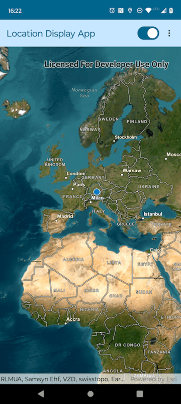

# MapView Location Display Micro-app

This micro-app demonstrates the use of `LocationDisplay` with a composable `MapView`.

## Usage

The application starts with a `LocationDisplay` set up and started. Use the switch in the app bar to start/stop the location display.
Use the overflow action button in the app bar to choose between different `LocationDisplayAutoPanMode` options.

For more information on the composable `MapView` component and how it works, see its [Readme](../../toolkit/geoview-compose/README.md).
