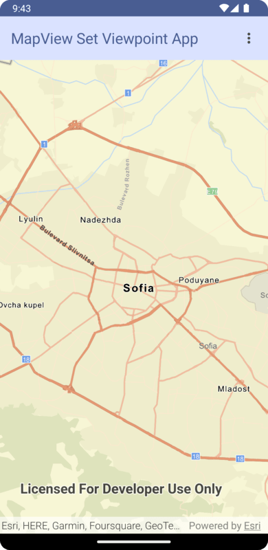

# MapView Set Viewpoint Micro-app

This micro-app demonstrates setting the viewpoint on a composable `MapView`.

## Usage

The application starts with a MapView and displays a map. Use the overflow action button in the app bar to choose between different methods of setting a viewpoint on the composable MapView. Each operation will set the viewpoint to a different location.

For more information on the composable `MapView` component and how it works, see it's [Readme](../../toolkit/geo-compose/README.md).
