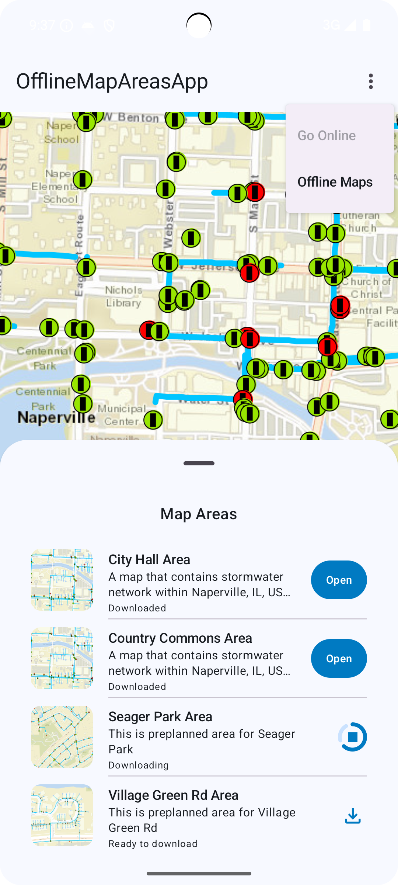
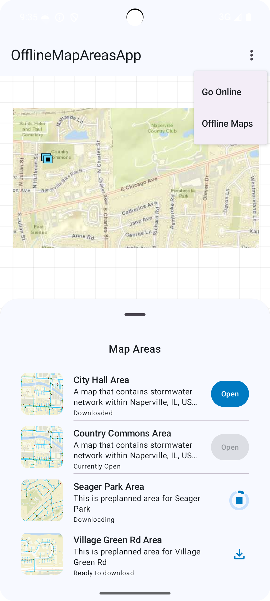
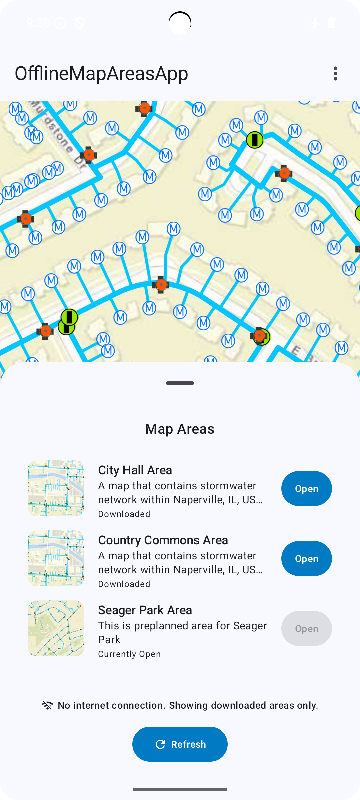

# OfflineMapAreas Micro-app

This micro-app demonstrates the use of the `OfflineMapAreas` toolkit component to take a web map offline by downloading map areas.

| Online map 	| Opened map 	| Offline mode 	|
|:---:	|---	|:---:	|
|  |  |  |

## Usage

The application displays the ahead-of-time (preplanned) maps available to download using the stormwater network within Naperville [web-map](https://arcgisruntime.maps.arcgis.com/home/item.html?id=acc027394bc84c2fb04d1ed317aac674). This app displays, downloads, and monitors the status of map areas, allowing users to view details or remove downloaded files. For preplanned maps, it shows available areas when online and downloaded ones when offline; for on-demand, users can define and download custom map areas.

For more information on the `OfflineMapAreas` component and how it works, see its [Readme](../../toolkit/offline).