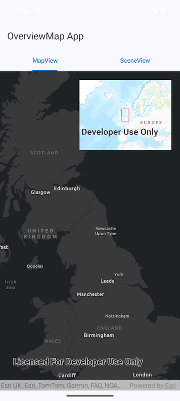

# Overview Map Micro-app

This micro-app demonstrates the use of the `OverviewMap` toolkit component which is a small,
secondary Map View (sometimes called an "inset map"), that can be superimposed on an existing Map
View or Scene View, which shows a representation of the main view's current viewpoint.

## Usage

Tha application shows two tabs, one that demonstrates the Overview Map being used with a Map View
and one that demonstrates the Overview Map being used with a Scene View.

For more information on the `OverviewMap` component and how it works, see
its [Readme](../../toolkit/geoview-compose#display-an-overviewmap).