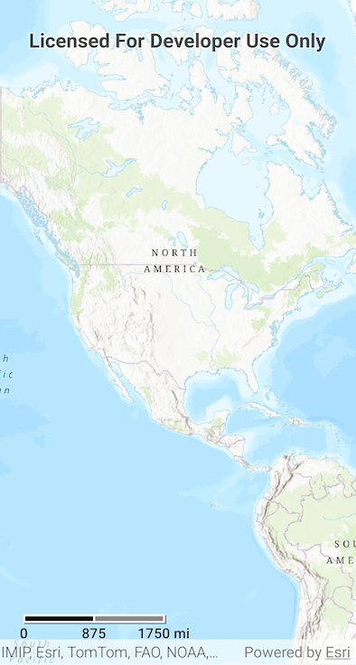

# Scalebar Micro-app

This micro-app demonstrates the use of the `Scalebar` toolkit component that visualizes an accurate distance that a user can use to visually gauge distances on a MapView.

## Usage

The application shows a Scalebar on the MapView's bottom left corner. The Scalebar updates the visual distance on the Map when the viewpoint of the MapView is changed by zooming in/out or panning.

For more information on the `Scalebar` component and how it works, see its [Readme](../../toolkit/scalebar/README.md).
