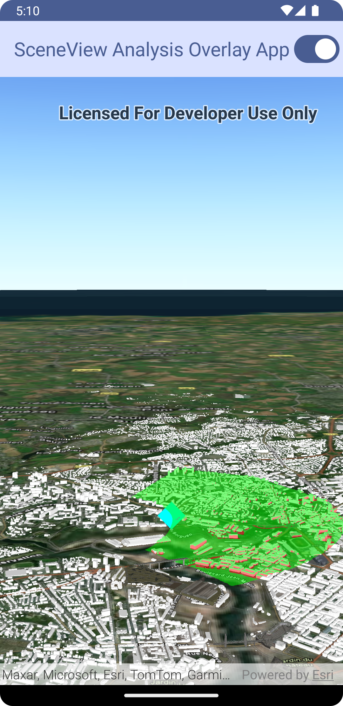

# SceneView Analysis Overlay Micro-app

This micro-app demonstrates the use of composable `SceneView's` `analysisOverlays` parameter to display spatial analysis results.

## Usage

The application starts with a SceneView and displays a scene of Brest, France. Use the switch to turn on and off a viewshed analysis from the viewpoint of the cyan diamond marker.

For more information on the composable `SceneView` component and how it works, see its [Readme](../../toolkit/geoview-compose/README.md).
