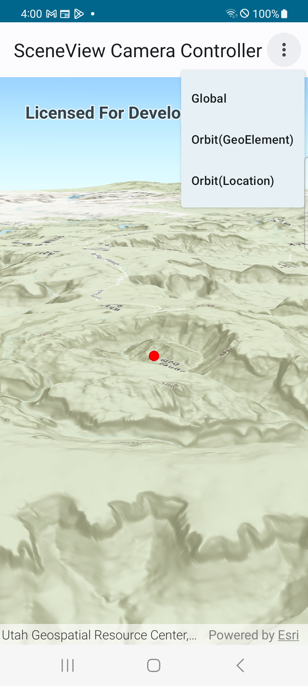

# SceneView CameraController Micro-app

This micro-app demonstrates the use of `CameraController` with a composable `SceneView`.

## Usage

The application begins with a SceneView and displays a global scene. Utilize the overflow action button in the app bar to select from various CameraController options for execution on the composable SceneView. Each operation will create and use a different CameraController to change the camera's viewpoint on the scene.

For more information on the composable `SceneView` component and how it works, see its [Readme](../../toolkit/geoview-compose/README.md).
