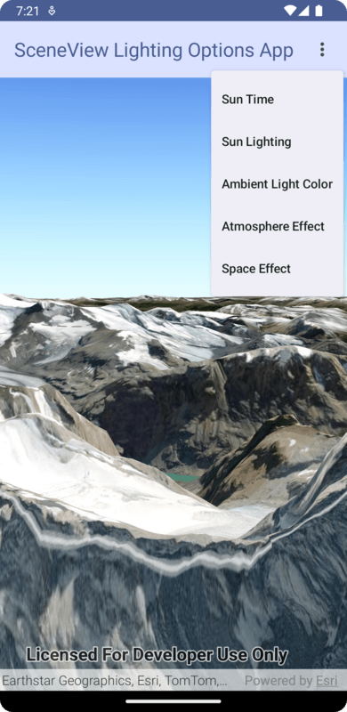

# SceneView Lighting Options Micro-app

This micro-app demonstrates the use of various lighting and rendering options for the composable `SceneView`

## Usage

The application starts with a `SceneView` displaying a scene. Use the overflow menu in the top right to select an option to change. An alert dialog will display allowing you to change the parameters of the selected option:

- Sun Time: allows you to choose a time of day which will set the sun's position when the `sunLighting` parameter is set to `LightingMode.Light` or `LightingMode.LightAndShadows`.
- Sun Lighting: allows you to choose how the composable `SceneView` renders ambient light.
- Ambient Light Color: allows you to set an RGBA color to use for ambient lighting.
- Atmosphere Effect: allows you to choose how the scene's atmosphere is rendered.
- Space Effect: allows you to choose how outer space is displayed in the scene.

For more information on the composable `SceneView` component and how it works, see its [Readme](../../toolkit/geoview-compose/README.md).

