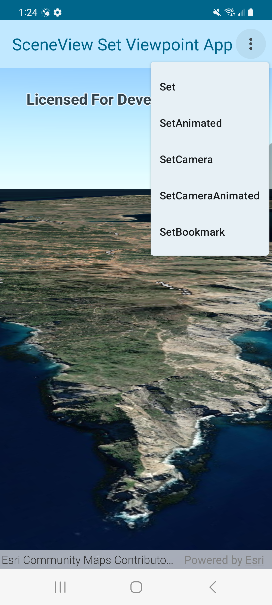

# SceneView Set Viewpoint Micro-app

This micro-app demonstrates setting the viewpoint on a composable `SceneView`.

## Usage

The application starts with a SceneView and displays a scene. Use the overflow action button in the app bar to choose between different methods of setting a viewpoint on the composable SceneView. Each operation will set the viewpoint to a different location.

For more information on the composable `SceneView` component and how it works, see its [Readme](../../toolkit/geoview-compose/README.md).

