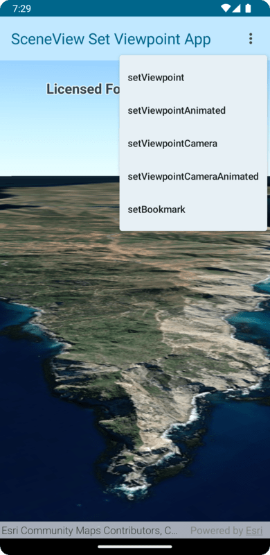

# MapView Set Viewpoint Micro-app

This micro-app demonstrates the use of `SceneViewpointOperation` with a composable `SceneView`.

## Usage

The application starts with a SceneView and displays a scene. Use the overflow action button in the app bar to choose between different `SceneViewpointOperation`s to be performed on the composable SceneView.

For more information on the composable `SceneView` component and how it works, see it's [Readme](../../toolkit/geo-compose/README.md).
