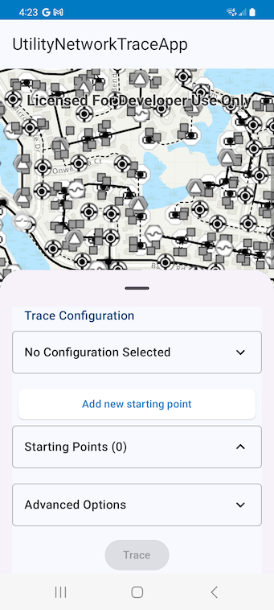
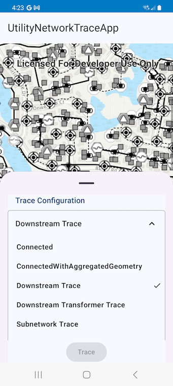
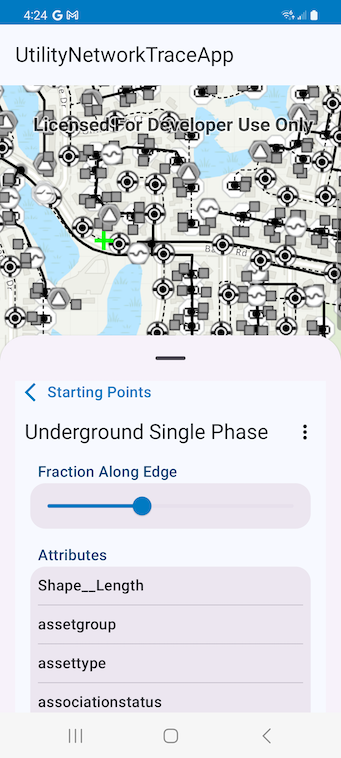
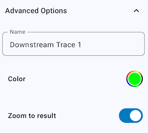
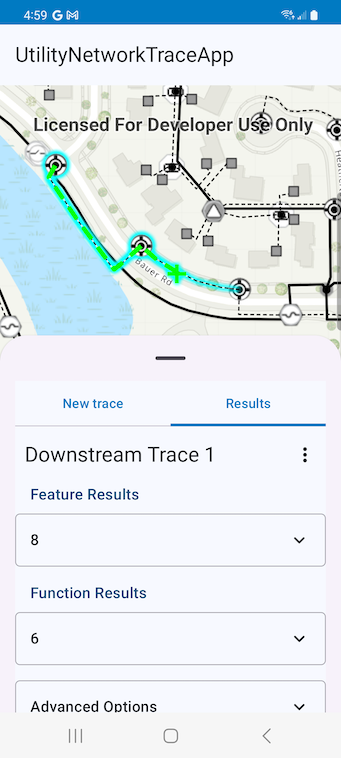

# UtilityNetworkTraceApp

This micro app showcases the use of the UtilityNetworks Trace toolkit component. It uses a webmap that comprises of the Utility Network data of naperville utilities.
The webmap is secured and requires username/password to access the data. Please add the username and password in the `local.properties` file as shown below.

```properties
traceToolUser="viewer01"
traceToolPassword="I68VGU^nMurF"
```



The app showcases how the Trace tool allows you to select a named trace configuration for performing a trace operation. The list of trace configurations is populated with the trace configurations defined for utility networks in a web map

|Trace Configurations|
|:--:|
||

The user can add startpoints by tapping on the `Add new starting point` button and can view its properties. 

|Starting Point Properties|
|:--:|
||

The user can set advanced properties to arrange the results of multiple traces by setting names and color

|Advanced Options|
|:--:|
||

The Trace tool shows the feature and function results in the UI and draws the geometry results as graphics on the map.

|Trace Results|
|:--:|
||


For more information on the composable `Trace` component and how it works, see its [Readme](../../toolkit/utilitynetworks/README.md).
