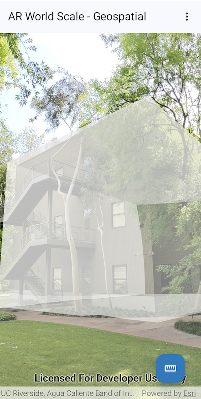

# Display scenes in Augmented Reality

Augmented reality experiences are designed to "augment" the physical world with virtual content that respects real world scale, position, and orientation of a device. In the case of AR in the Kotlin Toolkit, a SceneView displays 3D geographic data as virtual content on top of a camera feed which represents the real, physical world.

The Augmented Reality (AR) toolkit module allows quick and easy integration of AR into your application with `@Composable` components that render a `SceneView` in augmented reality using [ARCore](https://github.com/google-ar/arcore-android-sdk).

View the API Reference for the AR module [here](https://developers.arcgis.com/kotlin/toolkit-api-reference/arcgis-maps-kotlin-toolkit/com.arcgismaps.toolkit.ar/index.html).

The AR toolkit module provides two composable functions to render `ArcGISScene` content in AR:

| [TableTopSceneView](#TableTopSceneView)                         | [WorldScaleSceneView](#WorldScaleSceneView)                         |
|-----------------------------------------------------------------|---------------------------------------------------------------------|
|                                    |                  |
| In tabletop, scene content is anchored to a real-world surface. | In world-scale AR, scene content is integrated with the real world. |

## TableTopSceneView

The `TableTopSceneView` composable function renders `ArcGISScene` content anchored to a physical surface, as if it were a 3D-printed model.

### Features

- A composable function [TableTopSceneView](../../toolkit/ar/src/main/java/com/arcgismaps/toolkit/ar/TableTopSceneView.kt) that displays a camera feed overlayed by a `SceneView`.
- Detects physical horizontal surfaces in the camera feed, which a user can select by tapping on the screen. The tap location determines where the scene data is anchored on the detected surface.
- Provides parameters specific to table top scenarios to configure the placement and visualization of scene data:
    - `arcGISSceneAnchor` - A point in the `SceneView` to use as the anchor point of the scene data on the selected physical surface
    - `translationFactor` - Determines how many meters the scene camera moves as the device moves. A useful formula for determining this value is `translation factor = virtual content width / desired physical content width`. The virtual content width is the real-world size of the scene content and the desired physical content width is the physical table top width. The virtual content width is determined by the clipping distance in meters around the camera. For example, in order to setup a table top scene where scene data should be displayed within a 400 meter radius around the `arcGISSceneAnchor` and be placed on a table top that is 1 meter wide: `translation factor = 400 meter / 1 meter`.
    - `clippingDistance` - The distance in meters that the ArcGIS Scene data will be clipped around the `arcGISSceneAnchor`.
- Provides parameters to configure and interact with the `SceneView`, such as specifying an `ArcGISScene`, graphics overlays, lighting etc.
- A `TableTopSceneViewProxy` can be passed to the `TableTopSceneView` composable function to perform operations such as identify.
- A `TableTopSceneViewScope` provided as the receiver by the `TableTopSceneView`'s `content` lambda can be used to display a callout.

### Prerequisites

`TableTopSceneView` requires an [ARCore](https://github.com/google-ar/arcore-android-sdk) supported device that has installed Google Play Services for AR. An application must call [ArCoreApk.requestInstall](https://developers.google.com/ar/develop/java/enable-arcore#check_if_google_play_services_for_ar_is_installed) before using the `TableTopSceneView`. For an example see how it is done in the micro app's [MainActivity](../../microapps/ArTabletopApp/app/src/main/java/com/arcgismaps/toolkit/artabletopapp/MainActivity.kt).
Note - the `TableTopSceneView` checks for availability of ARCore when it enters the composition. If ARCore is not supported by the device or not installed, the `TableTopSceneView` will fail to initialize with `TableTopSceneViewStatus.FailedToInitialize`.

### Usage

The `TableTopSceneView` requires camera permissions, which are requested by default when the `TableTopSceneView` enters composition. The following camera-related settings need to be specified in the `AndroidManifest.xml`:

```xml
<uses-permission android:name="android.permission.CAMERA" />

<!-- Limits app visibility in the Google Play Store to ARCore supported devices
    (https://developers.google.com/ar/devices). -->
<uses-feature android:name="android.hardware.camera.ar" />
<uses-feature
    android:name="android.hardware.camera"
    android:required="true" />
```

If ARCore is not optional for your application to function (as is the case with the [microapp](../../microapps/ArTabletopApp)), you also need to add the following to your `AndroidManifest.xml`:

```xml
<!-- "AR Required" app, requires "Google Play Services for AR" (ARCore)
    to be installed, as the app does not include any non-AR features. -->
<meta-data android:name="com.google.ar.core" android:value="required" />
```

Configure an `ArcGISScene` with the data you want to render in the table top scene:

```kotlin

@Composable
fun MainScreen() {
    ...
    val arcGISScene = remember {
        ArcGISScene().apply {
            operationalLayers.add(
                ArcGISSceneLayer("https://tiles.arcgis.com/tiles/P3ePLMYs2RVChkJx/arcgis/rest/services/DevA_BuildingShells/SceneServer")
            )
            baseSurface = Surface().apply {
                elevationSources.add(
                    ElevationSource.fromTerrain3dService()
                )
            }
        }
    }
    ...
}
```

Define a location in your scene that should serve as the anchor point with the table top surface:

```kotlin
val arcGISSceneAnchor = remember {
    Point(-122.68350326165559, 45.53257485106716, 0.0, arcGISScene.spatialReference)
}
```

Determine a translation factor and clipping distance for your scene data as described above. Call the `TableTopSceneView` composable function with these parameters:

```kotlin
TableTopSceneView(
    arcGISScene = arcGISScene,
    arcGISSceneAnchor = arcGISSceneAnchor,
    translationFactor = 400.0,
    modifier = Modifier.fillMaxSize(),
    clippingDistance = 400.0,
    ...
)
```

Pass an `onInitializationStatusChanged` callback to the `TableTopSceneView` composable function to get notified about initialization status changes.

```kotlin
TableTopSceneView(
    arcGISScene = arcGISScene,
    arcGISSceneAnchor = arcGISSceneAnchor,
    translationFactor = 400.0,
    modifier = Modifier.fillMaxSize(),
    clippingDistance = 400.0,
    onInitializationStatusChanged = { status ->
       updateStatus(status)
    },
    ...
)
```

Make use of other features of a SceneView, for example handle `onSingleTapConfirmed` events and display a `Callout` at the tapped location:

```kotlin
var tappedLocation by remember { mutableStateOf<Point?>(null) }

TableTopSceneView(
    arcGISScene = arcGISScene,
    arcGISSceneAnchor = arcGISSceneAnchor,
    translationFactor = 400.0,
    modifier = Modifier.fillMaxSize(),
    clippingDistance = 400.0,
    onInitializationStatusChanged = { status ->
       updateStatus(status)
    },
    onSingleTapConfirmed = {
        val location = tableTopSceneViewProxy.screenToBaseSurface(it.screenCoordinate)
        location?.let { point ->
            tappedLocation = point
        }
    }
    ...
) {
    tappedLocation?.let {
        Callout(location = it, modifier = Modifier.wrapContentSize()) {
            Text(stringResource(R.string.lat_lon, it.y.roundToInt(), it.x.roundToInt()))
        }
    }
}
```

### Behaviour

To see it in action, check out the [microapp](https://github.com/Esri/arcgis-maps-sdk-kotlin-toolkit/tree/main/microapps/ArTabletopApp).

## WorldScaleSceneView

The `WorldScaleSceneView` composable function renders `ArcGISScene` content overlaid on the camera feed to scale, so real-world features like streets and buildings line up with the scene content.

The `WorldScaleSceneView` has two `WorldScaleTrackingMode`s: 
- `World`, which uses the device's GPS to position the scene content
- `Geospatial`, which uses the [ARCore Geospatial API](https://developers.google.com/ar/develop/geospatial) to position the scene content with high accuracy in areas with Google StreetView data.


### Features

- A composable function [WorldScaleSceneView](../../toolkit/ar/src/main/java/com/arcgismaps/toolkit/ar/WorldScaleSceneView.kt) that displays a camera feed overlayed by a `SceneView`.
- Uses the device's location depending on the [WorldScaleTrackingMode](../../toolkit/ar/src/main/java/com/arcgismaps/toolkit/ar/WorldScaleTrackingMode.kt) to position the scene camera so that the scene overlays the real-world features in the camera feed:
  - using GPS in `WorldScaleTrackingMode.World`
  - using Google's visual positioning service in `WorldScaleTrackingMode.Geospatial` 
- Provides parameters to configure and interact with the `SceneView`, such as specifying an `ArcGISScene`, graphics overlays, lighting etc.
- A `WorldScaleSceneViewProxy` can be passed to the `WorldScaleSceneView` composable function to perform operations such as identify.
- A `WorldScaleSceneViewScope` provided as the receiver by the `WorldScaleSceneView`'s `content` lambda can be used to display a callout or to display a `CalibrationView`, which lets the end user adjust the heading and elevation of the scene to more precisely match the real-world features.

### Prerequisites

`WorldScaleSceneView` requires an [ARCore](https://github.com/google-ar/arcore-android-sdk) supported device that has installed Google Play Services for AR. An application must call [ArCoreApk.requestInstall](https://developers.google.com/ar/develop/java/enable-arcore#check_if_google_play_services_for_ar_is_installed) before using the `WorldScaleSceneView`. For an example, see how it is done in the micro app's [MainActivity](../../microapps/ArWorldScaleApp/app/src/main/java/com/arcgismaps/toolkit/arworldscaleapp/MainActivity.kt).
Note - the `WorldScaleSceneView` checks for availability of ARCore when it enters the composition. If ARCore is not supported by the device or not installed, the `WorldScaleSceneView` will fail to initialize with `WorldScaleSceneViewStatus.FailedToInitialize`.

If using `WorldScaleTrackingMode.Geospatial`, the developer must configure their app to use keyless or API key [authentication with Google Cloud Console](https://developers.google.com/ar/develop/authorization?platform=android).

`WorldScaleSceneView` deploys projection engine data to the device to correctly position the scene in the EGM96 vertical coordinate system. If the `TransformationCatalog.projectionEngineDirectory` is already set by the developer prior to the first time `WorldScaleSceneView` enters the composition, then this projection engine data will not be deployed. In this case, the developer should ensure that an EGM96 grid file is present in the projection engine directory in order for the scene to be placed correctly.

Note that apps using ARCore must comply with ARCore's user privacy requirements. See [this page](https://developers.google.com/ar/develop/privacy-requirements) for more information.

### Usage

The `WorldScaleSceneView` requires camera and location permissions, which are requested by default when the `WorldScaleSceneView` enters composition. The following settings need to be specified in the `AndroidManifest.xml`:

```xml
<uses-permission android:name="android.permission.CAMERA" />
<uses-permission android:name="android.permission.ACCESS_FINE_LOCATION" />
<uses-permission android:name="android.permission.ACCESS_COARSE_LOCATION" />

<!-- Limits app visibility in the Google Play Store to ARCore supported devices
    (https://developers.google.com/ar/devices). -->
<uses-feature android:name="android.hardware.camera.ar" />
<uses-feature
    android:name="android.hardware.camera"
    android:required="true" />
```

If ARCore is not optional for your application to function (as is the case with the [microapp](../../microapps/ArWorldScaleApp)), you also need to add the following to your `AndroidManifest.xml`:

```xml
<!-- "AR Required" app, requires "Google Play Services for AR" (ARCore)
    to be installed, as the app does not include any non-AR features. -->
<meta-data android:name="com.google.ar.core" android:value="required" />
```

When using `WorldScaleTrackingMode.Geospatial`, a Google Cloud project configured for using the Geospatial API is required. There are two possible types to authenticate your application with the ARCore service:
1. [Keyless authentication](https://developers.google.com/ar/develop/authorization?platform=android#keyless-android)
2. [API key based authentication](https://developers.google.com/ar/develop/authorization?platform=android#api-key-android). An example of this is used in the [WorldScale micro app](../../microapps/ArWorldScaleApp/app/src/main/AndroidManifest.xml).

Configure an `ArcGISScene` with the data you want to render in the world scale scene:

```kotlin

@Composable
fun MainScreen() {
    ...
    val arcGISScene = remember {
        val basemap = Basemap(BasemapStyle.ArcGISHumanGeography)
        ArcGISScene(basemap).apply {
            // an elevation source is required for the scene to be placed at the correct elevation
            // if not used, the scene may appear far below the device position because the device position
            // is calculated with elevation
            baseSurface.elevationSources.add(ElevationSource.fromTerrain3dService())
            baseSurface.backgroundGrid.isVisible = false
        }
    }
    ...
}
```

Pass an `onInitializationStatusChanged` callback to the `WorldScaleSceneView` composable function to get notified about initialization status changes.

```kotlin
WorldScaleSceneView(
    arcGISScene = arcGISScene,
    modifier = Modifier.fillMaxSize(),
    onInitializationStatusChanged = { status ->
       updateStatus(status)
    },
    ...
)
```

Make use of other features of a SceneView, for example handle `onSingleTapConfirmed` events and place a `Graphic` on the base surface at that location:

```kotlin
val graphicsOverlays = remember { listOf(GraphicsOverlay()) }
WorldScaleSceneView(
    arcGISScene = arcGISScene,
    modifier = Modifier.fillMaxSize(),
    onInitializationStatusChanged = { status ->
       updateStatus(status)
    },
    worldScaleSceneViewProxy = proxy,
    onSingleTapConfirmed = { singleTapConfirmedEvent ->
		proxy.screenToBaseSurface(singleTapConfirmedEvent.screenCoordinate)
			?.let { point ->
				graphicsOverlays.first().graphics.add(
					Graphic(
						point,
						SimpleMarkerSceneSymbol(
							SimpleMarkerSceneSymbolStyle.Diamond,
							Color.green,
							height = 1.0,
							width = 1.0,
							depth = 1.0
						)
					)
				)
			}
	},
	graphicsOverlays = graphicsOverlays
    ...
)
```

### Behaviour

To see it in action, check out the [microapp](https://github.com/Esri/arcgis-maps-sdk-kotlin-toolkit/tree/main/microapps/ArWorldScaleApp).

