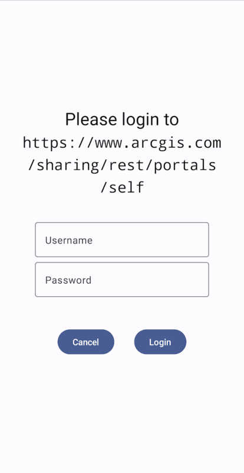

# Authenticator

The `Authenticator` component is a plug-and-play solution to handling authentication challenges with the ArcGIS Maps SDK for Kotlin. It will display a user interface when Network and ArcGIS authentication challenges occur.



## Features

The `Authenticator` is a Composable function that will display a prompt when it is asked to handle an authentication challenge. It can handle the following types of authentication:

- ArcGIS Authentication (token and OAuth)
- Integrated Windows Authentication (IWA)
- Client Certificate (PKI)
- Server Trust challenges

The `Authenticator` works directly with the `ArcGISEnvironment.authenticationManager`, so any configuration set on the `AuthenticationManager` (for example, credential persistence, interceptors, and the http cache) will be reflected in the `Authenticator`'s behavior.

A second Composable component, the `DialogAuthenticator` performs the same functionality as the `Authenticator` but presents IWA prompts and Server Trust prompts in an `AlertDialog`. In any of the code samples below, it is sufficient to replace `Authenticator` with `DialogAuthenticator` and the behavior should be identical.

## Usage

To see an example of how to use the `Authenticator`, try out the microapp [here](../../microapps/AuthenticationApp/README.md).

The `Authenticator` is designed to be displayed over the top of your app's UI. As such, it should be called at a near-root level, for example, at the same level as a `NavHost`; and it should be called at the bottom of the function, so it draws over other content. If you call other content after you call `Authenticator()`, that content will be displayed on top of it.

```kotlin
@Composable
fun MyApp() {
	val authenticatorState: AuthenticatorState = remember { AuthenticatorState() }
	MyAppContent()
	Authenticator(authenticatorState)
}
```

If you want your app to use OAuth, you should set the `AuthenticatorState.oAuthUserConfiguration` as well.

```kotlin
authenticatorState.oAuthUserConfiguration = OAuthUserConfiguration(
        "https://www.arcgis.com/",
        "<your-client-id>",
        "my-ags-app://auth"
    )
```
You will also need to declare the `OAuthUserSignInActivity` in your app's manifest like so to properly handle redirect intents from the browser where OAuth sign-in occurs.
```xml
<activity
	android:name="com.arcgismaps.toolkit.authentication.OAuthUserSignInActivity"
	android:configChanges="keyboard|keyboardHidden|orientation|screenSize"
	android:exported="true"
	android:launchMode="singleTop" >
	<intent-filter>
		<action android:name="android.intent.action.VIEW" />

		<category android:name="android.intent.category.DEFAULT" />
		<category android:name="android.intent.category.BROWSABLE" />

		<data
			android:host="auth"
			android:scheme="my-ags-app" />
	</intent-filter>
</activity>
```

### Intercepting Challenges

`AuthenticatorState` acts as the `NetworkAuthenticationChallengeHandler` and `ArcGISAuthenticationChallengeHandler` for your app by default. When you create it, you can choose not to set it as the default challenge handler if you wish:

```kotlin
class MyAppViewModel(application: Application) : AndroidViewModel(application), ArcGISAuthenticationChallengeHandler {

	val authenticatorState = AuthenticatorState(
		setAsArcGISAuthenticationChallengeHandler: Boolean = false,
		setAsNetworkAuthenticationChallengeHandler: Boolean = true
	)

    override suspend fun handleArcGISAuthenticationChallenge(challenge: ArcGISAuthenticationChallenge): ArcGISAuthenticationChallengeResponse (
        challenge: ArcGISAuthenticationChallenge
    ): ArcGISAuthenticationChallengeResponse {
		val shouldAuthenticatorHandleChallenge = someBusinessLogic(challenge)
		if (shouldAuthenticatorHandleChallenge) {
			return authenticatorState.handleArcGISAuthenticationChallenge(challenge)
		}
	}
}
```

### Intercepting OAuth Sign-in Redirects

The `Authenticator` launches a Custom Tab when an OAuth challenge is issued. When the Custom Tab completes with a redirect url, it is received by the `OAuthUserSignInActivity` that is declared in your app's manifest via its intent filter.

If you want to intercept this redirect before allowing the sign-in to complete, you can do that with the following steps:

1. Remove the `intent-filter` from the `OAuthUserSignInActivity` in your app's manifest and put it on the activity that you wish to receive the redirect intent:

```xml
<activity
	android:name=".MainActivity"
	android:exported="true"
	android:theme="@style/Theme.AuthenticationApp">
	<intent-filter>
		<action android:name="android.intent.action.MAIN" />

		<category android:name="android.intent.category.LAUNCHER" />
	</intent-filter>
	
	<intent-filter>
		<action android:name="android.intent.action.VIEW" />

		<category android:name="android.intent.category.DEFAULT" />
		<category android:name="android.intent.category.BROWSABLE" />

		<data
			android:host="auth"
			android:scheme="my-ags-app" />
	</intent-filter>
</activity>

<activity
	android:name="com.arcgismaps.toolkit.authentication.OAuthUserSignInActivity"
	android:configChanges="keyboard|keyboardHidden|orientation|screenSize"
	android:exported="true"
	android:launchMode="singleTop" >
</activity>
```

2. Handle the redirect in your app's activity:

```kotlin
override fun onCreate(savedInstanceState: Bundle?) {
	super.onCreate(savedInstanceState)
	// Handle OAuth redirect intents by checking the intent.data
	intent?.data?.let { uri ->
		val uriString = uri.toString()
		if (uriString.startsWith("my-ags-app")) {
			// Do whatever business logic your app requires
			val newIntent = Intent(this, OAuthUserSignInActivity::class.java).apply {
				data = uri
			}
			startActivity(newIntent)
		}
	}
}
```

Please note that the `OAuthUserSignInActivity` must have a `launchMode` of either `singleTop` or `singleInstance` for OAuth authentication to work.

### Launch OAuth Prompts in Incognito Mode

OAuth user sign in prompts are launched in a Custom Tab. Therefore, any credentials saved in the browser's cache could be used to authenticate a device. For enterprise sign-ins, this behavior may be problematic. Unfortunately, there is no programmatic way to remedy this. However, the `Authenticator` can be configured to launch OAuth prompts in incognito mode (which will not store credentials in the browser cache) like so:

- The device must have Chrome installed.
- The device's Chrome browser must have the following flags set to true:

```
chrome://flags/#cct-incognito
chrome://flags/#cct-incognito-available-to-third-party
```

- The Chrome browser must be relaunched for those flags to take effect.
- The `AuthenticatorState.oAuthUserConfiguration` must have the `preferPrivateWebBrowserSession` property set to true:

```kotlin
authenticatorState.oAuthUserConfiguration = OAuthUserConfiguration(
        "https://www.arcgis.com/",
        "<your-client-id>",
        "my-ags-app://auth",
        preferPrivateWebBrowserSession = true
    )
```

### Signing out

The authentication toolkit library provides an extension function on `AuthenticationManger` to remove any stored credentials:

```kotlin
ArcGISEnvironment.authenticationManager.signOut()
```
