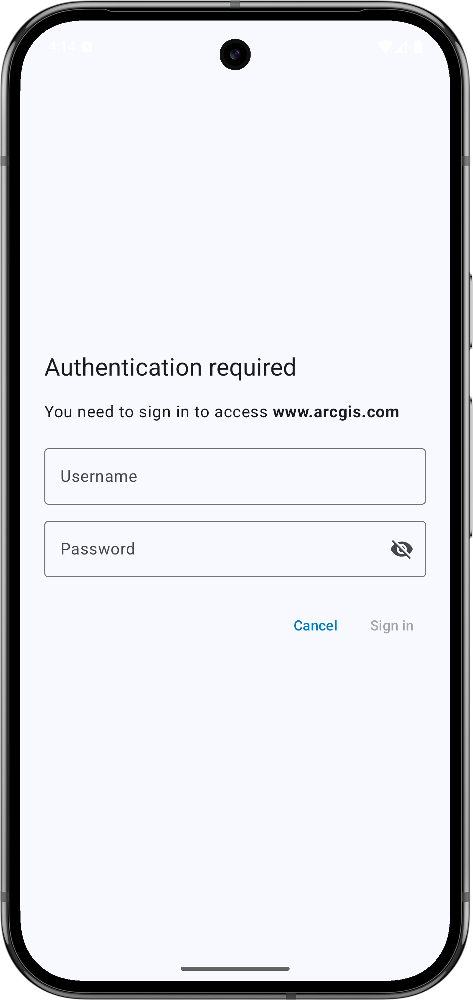

# Authenticator

The `Authenticator` is a ready-to-use component designed to simplify handling authentication challenges when working with the ArcGIS Maps SDK for Kotlin. It provides a user-friendly interface to manage various authentication scenarios, such as network and ArcGIS-specific authentication challenges, ensuring seamless integration into your app.



## Features

The `Authenticator` is a Composable function that will display a prompt when it is asked to handle an authentication challenge. It can handle the following types of authentication:

- ArcGIS Authentication (OAuth, Identity-Aware Proxy, and Token)
- Integrated Windows Authentication (IWA)
- Client Certificate (PKI)
- Server Trust challenges

The `Authenticator` works directly with the `ArcGISEnvironment.authenticationManager`, so any configuration set on the `AuthenticationManager` (for example, credential persistence, interceptors, and the http cache) will be reflected in the `Authenticator`'s behavior.

A second Composable component, the `DialogAuthenticator`, performs the same functionality as the `Authenticator` but presents Username/Password prompts and Server Trust prompts in a `Dialog`. In any of the code samples below, it is sufficient to replace `Authenticator` with `DialogAuthenticator` and the behavior will be identical.

## Usage

*View the API Reference for the `authentication` module [here](https://developers.arcgis.com/kotlin/toolkit-api-reference/arcgis-maps-kotlin-toolkit/com.arcgismaps.toolkit.authentication/index.html).*

To see an example of how to use the `Authenticator`, try out the microapp [here](../../microapps/AuthenticationApp/README.md).

The `Authenticator` is designed to be displayed over the top of your app's UI. As such, it should be called at a near-root level, for example, at the same level as a `NavHost`; and it should be called at the bottom of the function, so it draws over other content. If you call other content after you call `Authenticator()`, that content will be displayed on top of it.

```kotlin
@Composable
fun MyApp() {
    val authenticatorState: AuthenticatorState = remember { AuthenticatorState() }
    MyAppContent()
    Authenticator(authenticatorState)
}
```

To enable OAuth or Identity-Aware Proxy (IAP) authentication in your app, configure the `AuthenticatorState` with the corresponding properties:

```kotlin
val oAuthUserConfiguration = OAuthUserConfiguration(
    "https://www.arcgis.com/",
    "<your-client-id>",
    "my-ags-app://auth"
)
val iapConfiguration = IapConfiguration.create("Your IAP configuration JSON file path").getOrThrow()

authenticatorState.oAuthUserConfigurations = listOf(oAuthUserConfiguration)
authenticatorState.iapConfigurations = listOf(iapConfiguration)
```

To properly handle redirect intents from the browser during OAuth sign-in or IAP sign-in/sign-out, you must declare the `AuthenticationActivity` in your app's manifest as follows: 

```xml
<activity
    android:name="com.arcgismaps.toolkit.authentication.AuthenticationActivity"
    android:configChanges="keyboard|keyboardHidden|orientation|screenSize"
    android:exported="true"
    android:launchMode="singleTop">
    <intent-filter>
        <action android:name="android.intent.action.VIEW" />

        <category android:name="android.intent.category.DEFAULT" />
        <category android:name="android.intent.category.BROWSABLE" />

        <data
            android:host="auth"
            android:scheme="my-ags-app" />
    </intent-filter>
</activity>
```

**Note**: If the OAuth user configuration is invalid, the Authenticator will not launch a browser page and will prompt for a username and password instead.

### Intercepting Challenges

`AuthenticatorState` acts as the `NetworkAuthenticationChallengeHandler` and `ArcGISAuthenticationChallengeHandler` for your app by default. When you create it, you can choose not to set it as the default challenge handler if you wish:

```kotlin
class MyAppViewModel(application: Application) : AndroidViewModel(application), ArcGISAuthenticationChallengeHandler {

    val authenticatorState = AuthenticatorState(
        setAsArcGISAuthenticationChallengeHandler: Boolean = false,
        setAsNetworkAuthenticationChallengeHandler: Boolean = true
    )

    override suspend fun handleArcGISAuthenticationChallenge(challenge: ArcGISAuthenticationChallenge): ArcGISAuthenticationChallengeResponse (
        challenge: ArcGISAuthenticationChallenge
    ): ArcGISAuthenticationChallengeResponse {
        val shouldAuthenticatorHandleChallenge = someBusinessLogic(challenge)
        if (shouldAuthenticatorHandleChallenge) {
            return authenticatorState.handleArcGISAuthenticationChallenge(challenge)
        }
    }
}
```

### Intercepting OAuth Sign-in

The `Authenticator` launches a Custom Tab when an OAuth or Identity-Aware Proxy (IAP) challenge is issued. When the Custom Tab completes with a redirect url, it is received by the `AuthenticationActivity` that is declared in your app's manifest via its intent filter.

If you want to launch a Custom Tab from your own app's activity, follow these steps:

1. Remove the `AuthenticationActivity` in your app's manifest and put its intent filter on the activity that you wish to receive the redirect intent
2. Set your activity's `launchMode` to `singleTop`. 

   ℹ️ This is necessary because, when handling OAuth or IAP redirects, the Android system delivers the redirect intent to your activity. Using `singleTop` ensures that if your activity is already running at the top of the stack, a new instance is not created; instead, the existing instance receives the intent via `onNewIntent`. This allows your app to properly process authentication results without launching duplicate activities.

    ```xml
    <activity
        android:name="<Your-App-Activity-Name>"
        ...
        android:launchMode="singleTop"
        ...>
        <intent-filter>
            <action android:name="android.intent.action.VIEW" />
   
            <category android:name="android.intent.category.DEFAULT" />
            <category android:name="android.intent.category.BROWSABLE" />
   
            <data
                android:host="auth"
                android:scheme="my-ags-app"/>
        </intent-filter>
    </activity>
    ```
3. Call the extension function `launchCustomTabs` in the lambda `onPendingBrowserAuthenticationChallenge` of the `Authenticator`, passing in the pending `BrowserAuthenticationChallenge`:

    ```kotlin
    DialogAuthenticator(
        authenticatorState = authenticatorState,
        onPendingBrowserAuthenticationChallenge = { pendingBrowserAuthenticationChallenge ->
            launchCustomTabs(pendingBrowserAuthenticationChallenge)
        }
    )   
    ```

4. Handle the redirect in your app activity's `onNewIntent` and `onResume` overrides:

    - You can check if the `intent` was caused by an OAuth or IAP redirect because the `intent.data.toString()` will start with your OAuth or IAP configuration's redirect URI.

    - Currently, IAP sign-out does not redirect back to the app, so you will not receive an intent in `onNewIntent` or `onResume` for that case. Instead, this will need to be handled in `onResume` when the Custom Tab is closed.
     See documentation of [AuthenticatorState.completeBrowserAuthenticationChallenge](https://developers.arcgis.com/kotlin/toolkit-api-reference/arcgis-maps-kotlin-toolkit/com.arcgismaps.toolkit.authentication/complete-browser-authentication-challenge.html) for more details.
    
    ```kotlin
    override fun onNewIntent(intent: Intent?) {
        super.onNewIntent(intent)
        // This gets called first when OAuth or IAP redirects back to the app.
        authenticationAppViewModel.authenticatorState.completeBrowserAuthenticationChallenge(intent)
    }
    
    override fun onResume() {
        super.onResume()
        // This gets called when the Custom Tab is closed using the close button or the phone's back button.
        authenticationAppViewModel.authenticatorState.completeBrowserAuthenticationChallenge(intent)
    }
    ```

### Launch OAuth Prompts in Incognito Mode

OAuth user sign-in prompts are launched in a Custom Tab. Therefore, any credentials saved in the browser's cache could be used to authenticate a device. For enterprise sign-ins, this behavior may be problematic. Unfortunately, there is no programmatic way to remedy this. However, the `Authenticator` can be configured to launch OAuth prompts in incognito mode (which will not store credentials in the browser cache) like so:

- The device must have Chrome installed.
- The device's Chrome browser must have the following flags set to true:

```
chrome://flags/#cct-incognito
chrome://flags/#cct-incognito-available-to-third-party
```

- The Chrome browser must be relaunched for those flags to take effect.
- The `AuthenticatorState.oAuthUserConfiguration` must have the `preferPrivateWebBrowserSession` property set to true:

```kotlin
authenticatorState.oAuthUserConfiguration = OAuthUserConfiguration(
        "https://www.arcgis.com/",
        "<your-client-id>",
        "my-ags-app://auth",
        preferPrivateWebBrowserSession = true
    )
```

### Signing out

The authentication toolkit library provides a `signOut` function on `AuthenticatorState` to clear stored credentials, revoke OAuth Tokens, and launch the browser to invalidate the Identity-Aware Proxy (IAP) session if any IAP credentials are present.

```kotlin
authenticatorState.signOut()
```
