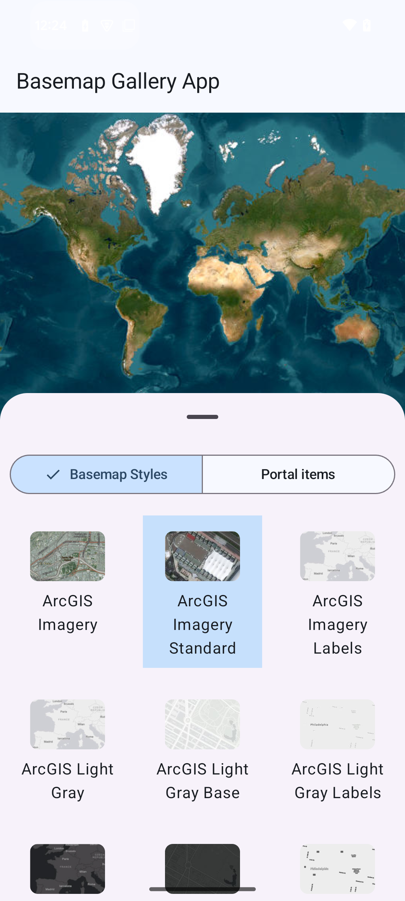

# Basemap Gallery
The Basemap Gallery displays a grid of available basemap styles. The gallery accepts a lambda that defines an action to take when a gallery item is clicked.



### Basic usage for displaying a Basemap Gallery
A simple workflow is to display the Basemap Gallery below a Map View and use `onItemClick` to set the map of the Map View.

Use the following code to create the `BasemapGalleryItem`s
```kotlin
viewModelScope.launch {
    val service = BasemapStylesService()
    service.load().getOrThrow()

    service.info?.stylesInfo?.forEach { basemapStyleInfo ->
        val galleryItem = BasemapGalleryItem(basemapStyleInfo)
        items.add(galleryItem)
    }
}
```
then create the UI with the `BasemapGallery` using those items like this
```kotlin
Column {
        MapView(
            modifier = Modifier
                .fillMaxSize()
                .weight(0.5f),
            arcGISMap = viewModel.arcGISMap,
        )
        BasemapGallery(modifier = Modifier.weight(0.5f), basemapGalleryItems = viewModel.items, onItemClick = {
            when (val tag = it.tag) {
                is BasemapStyleInfo -> {
                    Log.d("BasemapGallery", "Item clicked: ${tag.styleName}")
                    viewModel.arcGISMap.setBasemap(Basemap(tag.style))
                } else -> Log.d("BasemapGallery", "Item clicked: tag type is not handled")
            }
        })
    }
```
To do the same for a 3D scene, simply replace the `MapView` with a `SceneView` and the `ArcGISMap` with an `ArcGISScene`.

## Example
To see it in action, try out the [Basemap Gallery micro-app](../../microapps/BasemapGalleryApp) and refer to [MainScreen.kt](../../microapps/BasemapGalleryApp/app/src/main/java/com/arcgismaps/toolkit/basemapgalleryapp/screens/MainScreen.kt) in the project.
