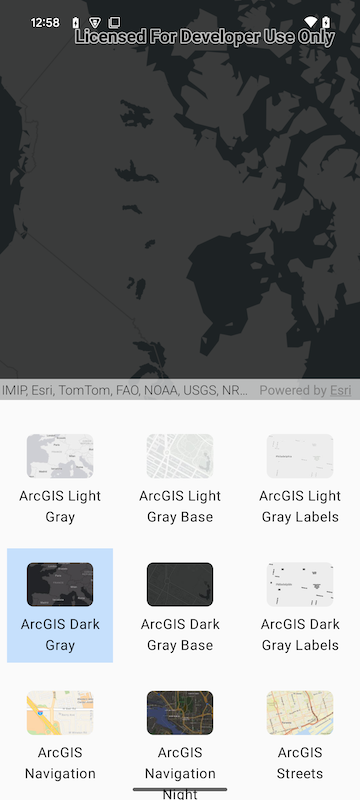

# Basemap Gallery
The Basemap Gallery displays a grid of available basemap styles. The gallery accepts a lambda that defines an action to take when a gallery item is clicked.



### Basic usage for displaying a Baemap Gallery
A simple workflow is to disply the Basemap Gallery below a Map View and use the `onItemClick` to set the map of the Map View.

```kotlin
Column {
        MapView(
            modifier = Modifier
                .fillMaxSize()
                .weight(0.5f),
            arcGISMap = viewModel.arcGISMap,
        )
        BasemapGallery(modifier = Modifier.weight(0.5f), basemapGalleryItems = viewModel.items, onItemClick = {
            when (val tag = it.tag) {
                is BasemapStyleInfo -> {
                    Log.d("BasemapGallery", "Item clicked: ${tag.styleName}")
                    viewModel.arcGISMap.setBasemap(Basemap(tag.style))
                } else -> Log.d("BaseMapGalley", "Item clicked: tag type is not handled")
            }
        })
    }
```

## Example
To see it in action, try out the [Basemap Gallery micro-app](../../microapps/BasemapGAlleryApp) and refer to [MainScreen.kt](../../microapps/BasemapGalleryApp/app/src/main/java/com/arcgismaps/toolkit/basemapgalleryapp/screens/MainScreen.kt) in the project
