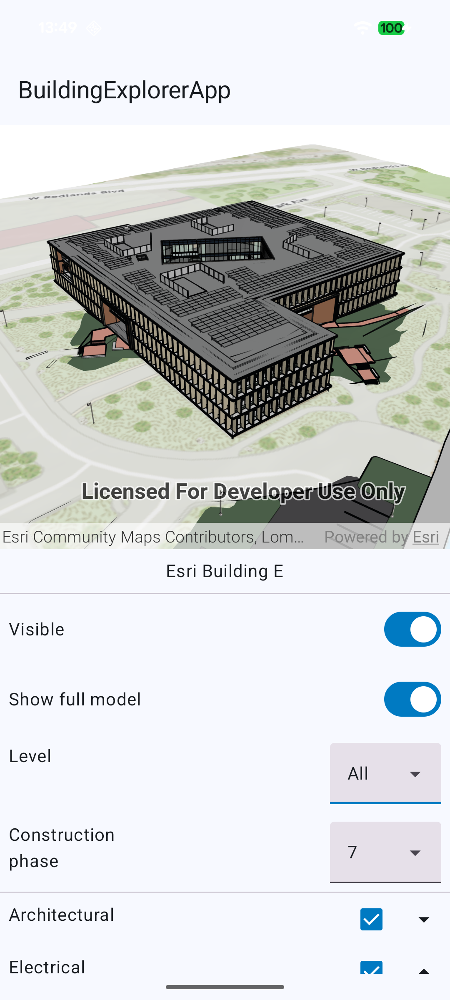

# Building Explorer

The Building Explorer provides a tool for users to browse the levels and sublayers of the building scene layers in a Scene.



### Features

- Select building scene layers from a dropdown list.
- Switching the visibility of the building scene layer.
- Switching between the Overview model (if available) and the Full Model.
- Selecting a level of the building to highlight in the view.
    - The selected level and all the features of the level are rendered normally.
    - Levels above are hidden.
    - Levels below are given an Xray style.
- Visibility of building feature disciplines and categories can be toggled on and off.

### Basic usage for displaying a Building Explorer

Create a `BuildingExplorerState` with a list of `BuildingSceneLauyers`

```kotlin
    lateinit var buildingExplorerState: BuildingExplorerState

    init {
        viewModelScope.launch {
            scene.load()
                .onFailure { throw it }
                .onSuccess {
                    val layers =
                        scene.operationalLayers.filterIsInstance<BuildingSceneLayer>()
                            .toPersistentList()

                    buildingExplorerState = BuildingExplorerState(
                        buildingSceneLayers = layers,
                        coroutineScope = viewModelScope
                    )
                }
        }
    }
```

Create a `BuildingExplorer` taking the `BuildingExploereState` and add it to the UI

```kotlin
Column {
    LocalSceneView(
        scene = viewModel.scene, 
        modifier = Modifier.weight(0.5f))
    BuildingExplorer(
        state = viewModel.buildingExplorerState,
        modifier = Modifier.weight(0.5f)
    )
}
```

## Example

To see it in action, try out the [Building Explorer micro-app](../../microapps/BuildingExplorerApp) and refer to [MainScreen.kt](../../microapps/BasemapGalleryApp/app/src/main/java/com/arcgismaps/toolkit/buildingexplorerapp/screens/MainScreen.kt) in the project.
