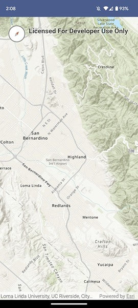

# Compass
The Compass displays the current viewpoint rotation of a MapView by displaying a compass icon that points north.
The Compass supports resetting the rotation by tapping the icon, which resets the map to its default 0 degree orientation.

By default the Compass is set to auto hide, hence it will only appear when the map is rotated and is hidden when the current map orientation is 0 degrees. This behavior is configurable.

Note that the MapView auto-snaps back to north when it's within a threshold of north, and in that case the compass also auto hides.



## Features

Compass:
- Built with Jetpack Compose.
- Automatically hides when the rotation is zero.
- Can be configured to be always visible.
- Will reset the map rotation to North when tapped.

## Behavior

The `autoHide` property can be used to configure the visibility behavior of the compass. With `autoHide` enabled, whenever the map is not oriented north (non-zero orientation)
the compass appears. When reset to north, it disappears. When `autoHide` is disabled, the compass is always visible.

## Usage

*View the API Reference for the `compass` module [here](https://developers.arcgis.com/kotlin/toolkit-api-reference/arcgis-maps-kotlin-toolkit/com.arcgismaps.toolkit.compass/index.html).*

### Basic usage for displaying a `Compass` on a `MapView`

The simplest workflow is to display the `Compass` composable over the top of a composable `MapView` using a `Box` 
The tap action is provided as a callback using the `onClick()` lambda. This can be used to reset the rotation of the MapView.

```kotlin
// create an ArcGISMap with a Topographic basemap style
val arcGISMap by remember {
    mutableStateOf(
        ArcGISMap(BasemapStyle.ArcGISTopographic).apply {
            // set the map's viewpoint to North America
            initialViewpoint = Viewpoint(39.8, -98.6, 10e7)
        }
    )
}
var mapRotation by remember { mutableDoubleStateOf(0.0) }
val mapViewProxy = remember { MapViewProxy() }
// show composable MapView with compass
Box(
    modifier = Modifier.fillMaxSize()
) {
    MapView(
        arcGISMap,
        modifier = Modifier.fillMaxSize(),
        mapViewProxy = mapViewProxy,
        onMapRotationChanged = { rotation -> mapRotation = rotation }
    )
    Row(
        modifier = Modifier
            .height(IntrinsicSize.Max)
            .fillMaxWidth()
            .padding(25.dp)
    ) {
        val coroutineScope = rememberCoroutineScope()
        // show the compass and pass the mapRotation state data
        Compass(rotation = mapRotation) {
            // reset the Composable MapView viewpoint rotation to point north
            coroutineScope.launch {
                mapViewProxy.setViewpointRotation(0.0)
            }
        }
    }
}
```

To configure the auto-hide behavior, pass in the `autoHide` parameter.

```kotlin
// show the compass and pass the current mapRotation
Compass(rotation = mapRotation, autoHide = false) {
    // reset the ComposableMap viewpoint rotation to point north using the MapInterface
    mapInterface.setViewpointRotation(0.0)
}
```

## Example
To see it in action, try out the [Compass micro-app](../../microapps/CompassApp) and refer to [MainScreen.kt](../../microapps/CompassApp/app/src/main/java/com/arcgismaps/toolkit/compassapp/screens/MainScreen.kt) in the project.
