# FeatureForm

## Description

The `FeatureForm` toolkit component enables users to display and edit feature attributes and attachments in a layer using the `FeatureForm` API.
FeatureForms can be authored as part of the web map using [Field Maps Designer](https://www.arcgis.com/apps/fieldmaps/) or using Map Viewer. This allows a simplified user experience to edit feature attribute data on the web map.

More information about editing attributes using forms can be found [here](https://developers.arcgis.com/kotlin/edit-features/overview-edit-using-feature-forms/).

## Features

The `FeatureForm` is a composable that can render a `FeatureForm` object with a `FeatureFormDefinition`  using Jetpack Compose.

- It can be integrated into any custom layout or container.
- All expressions present in the form are initially evaluated with a progress indicator before the FeatureForm is available for editing.
- Provides automatic saving and restoring of form data after device configuration changes.
- Provides a DateTime picker and a picker for coded-value field types.
- Shows Validation errors for any fields with errors.
- Visibility behavior of validation errors can be customized. See [Changing the Validation Error Visibility policy](#changing-the-validation-error-visibility-policy).
- Supports viewing Utility Network Associations and navigating to associated features. See [section](#utility-associations-and-navigation) for more info.
- Follows material 3 design system.

## Usage

To see it in action, check out the [microapp](../../microapps/FeatureFormsApp). The micro-app integrates the `FeatureForm` component into a `BottomSheet`.

*View the Toolkit API Reference for the `featureforms` module [here](https://developers.arcgis.com/kotlin/toolkit-api-reference/arcgis-maps-kotlin-toolkit/com.arcgismaps.toolkit.featureforms/index.html).*

To display a `FeatureForm` the first step is to create a `FeatureFormState` object as follows.

> *Note:* In version 200.8.0, the `FeatureForm` compose API has been updated to improve functionality and support advanced editing workflows that involve Utility Network Associations through the use of a `FeatureFormState` class.

### Creating the FeatureFormState

```kotlin
// create the FeatureForm from the Feature
val featureForm = FeatureForm(arcGISFeature)
// create the state object
val featureFormState = FeatureFormState(featureForm, coroutineScope)
```

The state object must be hoisted out of the composition to prevent data loss during configuration changes, ideally at the ViewModel level. Refer to the Compose [state hoisting guide](https://developer.android.com/develop/ui/compose/state-hoisting#screen-ui-state) for details.

It is important that the `CoroutineScope` provided is [Lifecycle-aware](https://developer.android.com/topic/libraries/architecture/coroutines#lifecycle-aware). This ensures that coroutines launched for tasks like expression evaluation, data fetching (e.g., attachments, associations), etc., are not cancelled during configuration changes.

### Creating a FeatureForm UI in Compose

A `FeatureForm` can be created within a composition by simply calling the `FeatureForm` composable with the `FeatureFormState` object. The FeatureForm should be displayed in a container. Its visibility and the container are external and should be controlled by the calling Composable.

```kotlin  
@Composable  
fun MyComposable(featureFormState : FeatureFormState) {  
    // a container  
    MyContainer(modifier = Modifier) {
        // create a FeatureForm Composable
        FeatureForm(  
            // pass in the FeatureFormState object  
            featureFormState = featureFormState,  
            // control the layout using the modifier property  
            modifier = Modifier.fillMaxSize()  
        )  
    }  
} 
```  

### Updating the `FeatureForm`

To display a new `FeatureForm`, simply trigger a recomposition with a new `FeatureFormState` object.

```kotlin  
@Composable  
fun MyComposable(viewModel : MyViewModel) {  
    // use a state object that will recompose this composable when the state changes
    // in this example, the FeatureFormState object is hoisted in the ViewModel
    val state by viewModel.featureFormState  
    // a container  
    MyContainer(modifier = Modifier) {
        FeatureForm(    
            featureFormState = state,  
            modifier = Modifier.fillMaxSize()
        )  
    }  
}
```  

### Changing the Validation Error Visibility policy

By default validation errors for any fields are only visible after the fields gain focus. But this can be customized using the `validationErrorVisibility` parameter of the `FeatureForm`. This property can be changed at any time to show all the errors. It supports two modes of visibility.

- **ValidationErrorVisibility.Automatic** : *Indicates that the validation errors are only visible for editable fields that have received focus.*
- **ValidationErrorVisibility.Visible** : *Indicates the validation is run for all the editable fields, and errors are displayed regardless of the focus state.*

```kotlin
@Composable
FeatureForm(  
    featureFormState = state,  
    modifier = Modifier.fillMaxSize(),  
    validationErrorVisibility = ValidationErrorVisibility.Visible  
)
```

> *Note:* : Once the `validationErrorVisibility`  is set to `Visible`, changing it back to `Automatic` will have no effect since all the fields have now gained focus to show any errors.

### Close Icon

Beginning with version 200.8.0, a close icon is now displayed in the bottom right corner of the form. The `onDismiss` parameter allows handling the tap action. The container can then remove the FeatureForm from the composition using this tap action.

 The icon can be hidden by setting the parameter  `showCloseIcon: Boolean` to `false`.

### Action Bar

Beginning with version 200.8.0, when edits are present in the `FeatureForm`, an action bar is displayed at the top of the form with “Save” and “Discard” buttons. This can be hidden by setting `showFormActions: Boolean` to `false`.

A new `onEditingEvent` callback of type `FeatureFormEditingEvent` is introduced which is invoked when the user performs the "Save" or "Discard" action. This event can be used to perform any additional tasks such as rolling back changes on "Discard" or applying edits to the service on "Save". The [microapp](../../microapps/FeatureFormsApp) uses this mechanism.

### Utility Associations and Navigation

The `FeatureForm` composable, introduced in version 200.8.0, leverages the `FeatureFormState` class to support the `UtilityAssociationsFormElement`. This enhancement enables more advanced workflows such as viewing utility network associations for the feature being edited and navigating to and editing associated features.

When a `UtilityAssociationsFormElement` is present in the form definition, the toolkit displays the element based on its configuration. The behavior of this element is detailed [here](#utilityassociationsformelement).

If the user taps on an association and there are no edits in the current `FeatureForm`, the component navigates to a new `FeatureForm` created for the associated feature. The Android system's back action, along with the provided back button, allows navigation back to the previous `FeatureForm` screen.

During navigation, the `FeatureFormState.activeFeatureForm` observable property is updated with the new `FeatureForm` instance as the user moves forward or backward through associations.

If edits exist in the current `FeatureForm`, a dialog prompts the user to save or discard changes before proceeding to the next or previous `FeatureForm`. Navigation can be disabled using the `isNavigationEnabled: Boolean` parameter.

### Permissions

The `FeatureForm` component requires the following permissions to function correctly. These permissions are added to the AndroidManifest.xml file of the library. But the calling app should request these permissions at runtime. If the permissions are not granted, the respective functionality will be limited.

- `Manifest.permission.CAMERA` : Required to use the camera for the `BarcodeScannerFormInput` input type and the `AttachmentsFormElement` to add attachments.

## Behavior

- The `FeatureForm` composable will display the form fields in the order they are defined in the `FeatureFormDefinition`.
- The component supports the following configurable [FormElement](https://developers.arcgis.com/kotlin/api-reference/arcgis-maps-kotlin/com.arcgismaps.mapping.featureforms/-form-element/index.html?query=sealed%20class%20FormElement) types as user input fields.
  
### [AttachmentsFormElement](https://developers.arcgis.com/kotlin/api-reference/arcgis-maps-kotlin/com.arcgismaps.mapping.featureforms/-attachments-form-element/index.html?query=class%20AttachmentsFormElement%20:%20FormElement)

- The `AttachmentsFormElement` is used to display and manage attachments for a feature. It allows users to add, view, and delete attachments.
- If camera permissions are not granted, the "Add" button will not be visible.

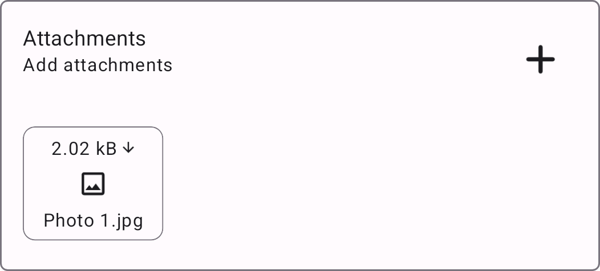
  
### [FieldFormElement](https://developers.arcgis.com/kotlin/api-reference/arcgis-maps-kotlin/com.arcgismaps.mapping.featureforms/index.html#416104072%2FClasslikes%2F-1844196645) with the following [FormInput](https://developers.arcgis.com/kotlin/api-reference/arcgis-maps-kotlin/com.arcgismaps.mapping.featureforms/index.html#902783574%2FClasslikes%2F-1844196645) types -

#### [BarcodeScannerFormInput](https://developers.arcgis.com/kotlin/api-reference/arcgis-maps-kotlin/com.arcgismaps.mapping.featureforms/index.html#1532812564%2FClasslikes%2F-1844196645)

- The `BarcodeScannerFormInput` is a type of text input that also allows users to scan barcodes using the device's camera.
- If camera permissions are not granted, the barcode scanner will not be available, and the input will behave like a normal text input.
- The barcode scanner supports the following barcode formats: [BarcodeFormat](https://developers.google.com/android/reference/com/google/mlkit/vision/barcode/common/Barcode.BarcodeFormat).
- To scan a barcode:
  - Tap on the barcode accessory icon to open the camera.
  - The barcode should be in the camera's viewfinder. Once the barcode is detected, the camera will automatically close, and the barcode value will be populated in the input field.
  - If there are multiple barcodes in the camera's viewfinder, tapping on the desired barcode will select the barcode and populate the value in the input field.
  - A mild haptic feedback is triggered when a barcode is detected and scanned successfully.

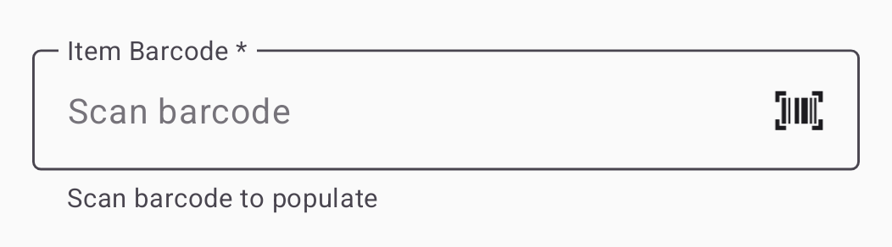

#### [ComboBoxFormInput](https://developers.arcgis.com/kotlin/api-reference/arcgis-maps-kotlin/com.arcgismaps.mapping.featureforms/index.html#-3732077%2FClasslikes%2F-1844196645)

- This input type is used for fields with a coded value domain.
- The user can select a value from a list of predefined values using the picker.
- If the current value is not one of the possible values, when the picker is displayed, the selected value will be displayed in an "Unsupported Type" section at the bottom of the picker.
Once a valid value is selected, the "Unsupported Type" section will be hidden.

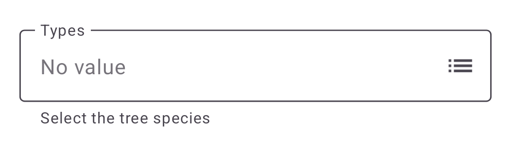
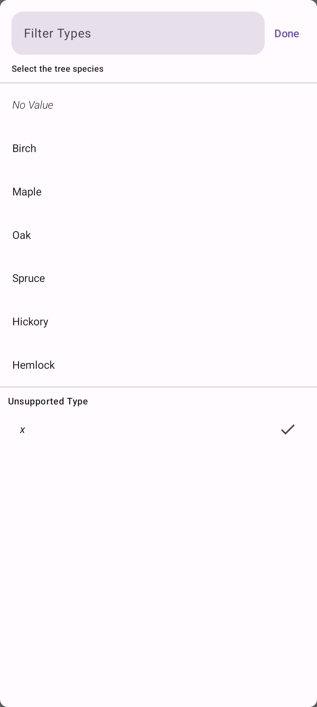

#### [DateTimePickerFormInput](https://developers.arcgis.com/kotlin/api-reference/arcgis-maps-kotlin/com.arcgismaps.mapping.featureforms/index.html#-399367937%2FClasslikes%2F-1844196645)

- This input type is used for fields with a date-time or date-only data type.
- The user can select a date and time using the date-time picker. 
- The [date](https://m3.material.io/components/date-pickers/overview) and [time](https://m3.material.io/components/time-pickers/overview) picker are based on the material3 design system.

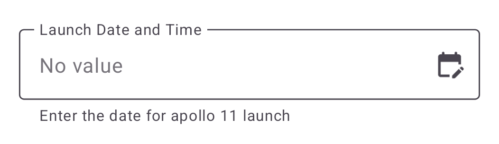

#### [RadioButtonsFormInput](https://developers.arcgis.com/kotlin/api-reference/arcgis-maps-kotlin/com.arcgismaps.mapping.featureforms/index.html#-802642052%2FClasslikes%2F-1844196645)

- This input type provides a radio button group for fields with a coded value domain.
- If the current value is not one of the possible values, it is displayed as a `ComboBoxFormInput`.

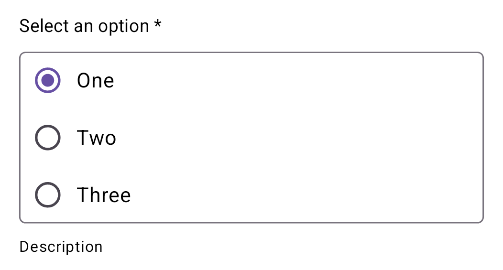

#### [SwitchFormInput](https://developers.arcgis.com/kotlin/api-reference/arcgis-maps-kotlin/com.arcgismaps.mapping.featureforms/index.html#-810335126%2FClasslikes%2F-1844196645)

- This input type provides a switch for fields with only two possible coded values.
- If the current value is not one of the two possible values, the switch is displayed as a `ComboBoxFormInput`.

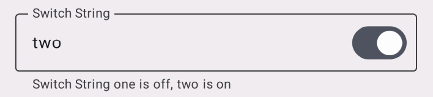

#### [TextAreaFormInput](https://developers.arcgis.com/kotlin/api-reference/arcgis-maps-kotlin/com.arcgismaps.mapping.featureforms/index.html#1246148688%2FClasslikes%2F-1844196645)

- Provides a multi-line text input field.

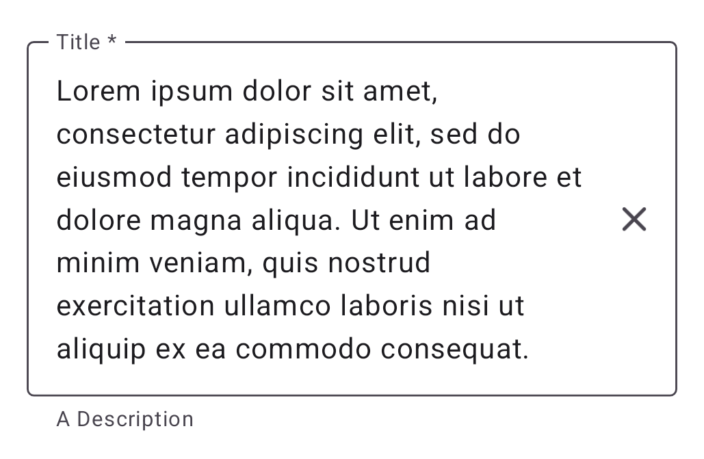

#### [TextBoxFormInput](https://developers.arcgis.com/kotlin/api-reference/arcgis-maps-kotlin/com.arcgismaps.mapping.featureforms/index.html#-2106495906%2FClasslikes%2F-1844196645)

- Provides a single-line text input field.

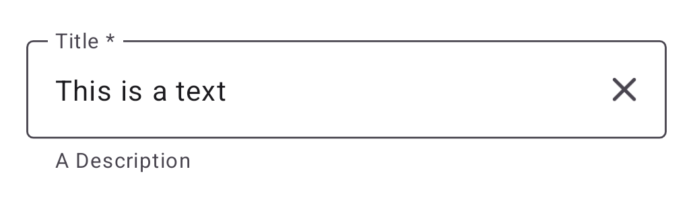

#### Read-Only Fields

- Any field that not editable as indicated by the [isEditable](https://developers.arcgis.com/kotlin/api-reference/arcgis-maps-kotlin/com.arcgismaps.mapping.featureforms/-field-form-element/index.html#279696009%2FProperties%2F-1844196645) property will be displayed as read-only field with
special styling.
- If the field is backed by an arcade expression as indicated by [hasValueExpression](https://developers.arcgis.com/kotlin/api-reference/arcgis-maps-kotlin/com.arcgismaps.mapping.featureforms/-field-form-element/index.html#854459496%2FProperties%2F-1844196645), the icon `<>` will be displayed next to the field.

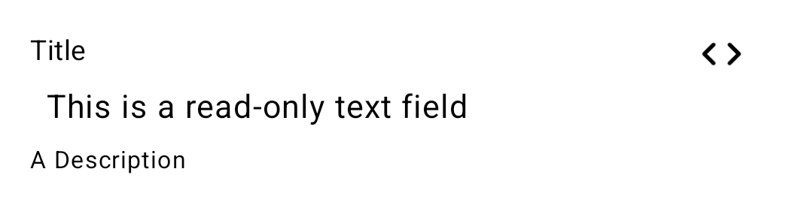
  
### [GroupFormElement](https://developers.arcgis.com/kotlin/api-reference/arcgis-maps-kotlin/com.arcgismaps.mapping.featureforms/index.html#-414583411%2FClasslikes%2F-1844196645)

- The `GroupFormElement` is used to group multiple `FieldFormElement`s together.
- The group can be collapsed or expanded by tapping on the header.

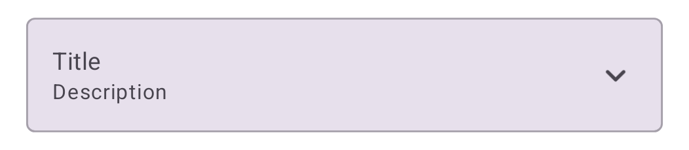

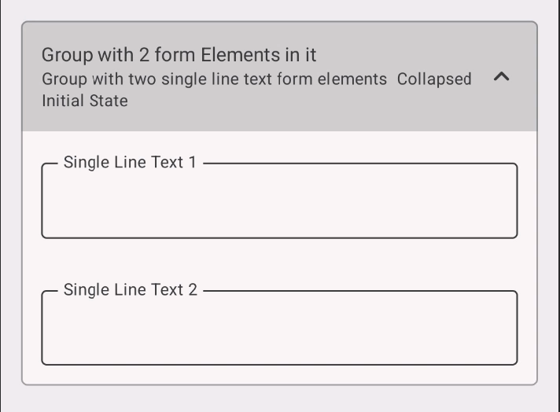

### [TextFormElement](https://developers.arcgis.com/kotlin/api-reference/arcgis-maps-kotlin/com.arcgismaps.mapping.featureforms/-text-form-element/index.html)

- The `TextFormElement` is used to display text in the form.
- It supports plain text and markdown text.

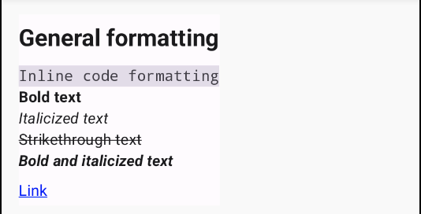

### UtilityAssociationsFormElement

- The `UtilityAssociationsFormElement` is used to display utility network associations in the form.
- It supports grouping associations by their type and network source.
- Navigating to edit another feature on the other side of the association is also supported.

#### The element with different association types with the count of total associations is displayed

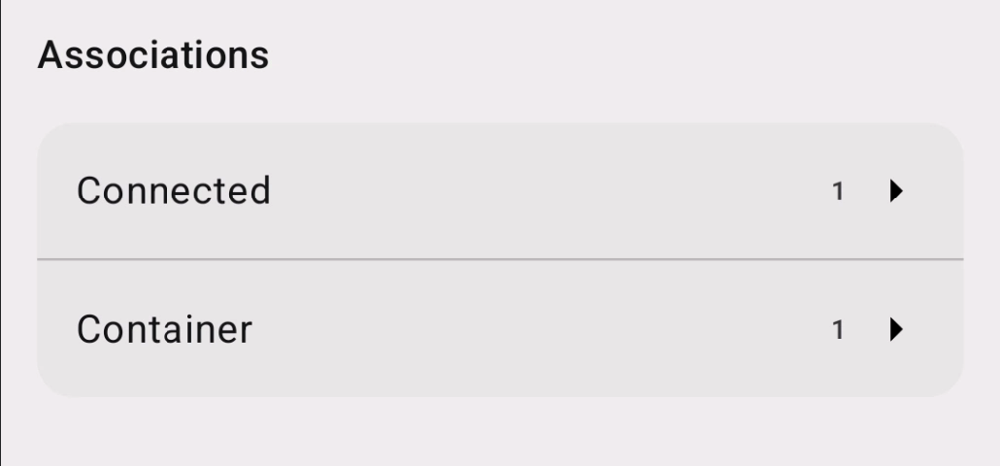

#### Each association type shows the different network sources present

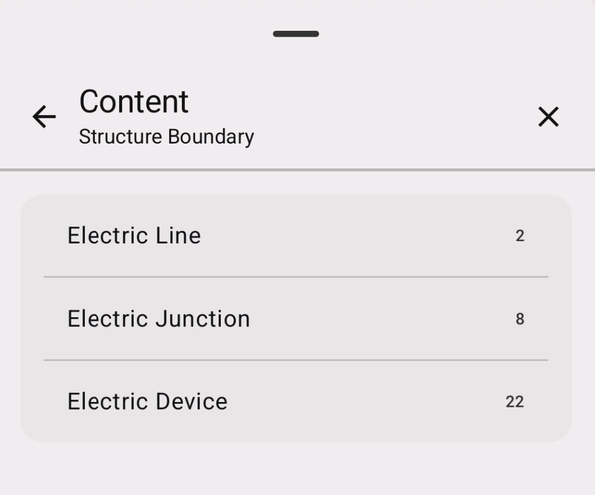

#### Final page shows the utility associations for the selected network source

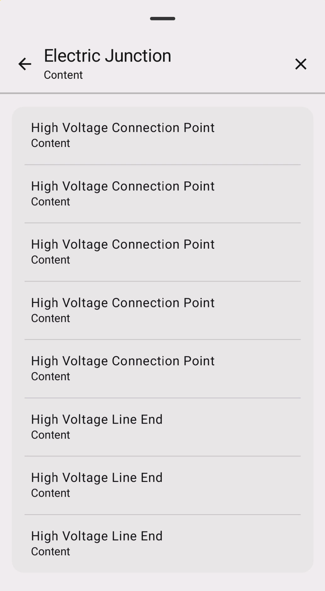

## Theming and Customization

`FeatureForm` uses the material3 theming system. These styles and colors are customizable through the `FeatureForms` composable function's public API. The following `colors` and `typography` are used by the respective fields.

#### Text Fields
- Outline color - `MaterialTheme.colorScheme.outline`
- Label TextStyle - `MaterialTheme.typography.bodySmall`
- Input TextStyle - `MaterialTheme.typography.bodyLarge`
- SupportingText TextStyle - `MaterialTheme.typography.bodySmall`
- Error color - `MaterialTheme.colorScheme.error`

#### Radio Buttons
- Outline color - `MaterialTheme.colorScheme.outline`
- Label TextStyle - `MaterialTheme.typography.bodyMedium`
- Options TextStyle - `MaterialTheme.typography.bodyLarge`
- SupportingText TextStyle - `MaterialTheme.typography.bodySmall`
- Error color - `MaterialTheme.colorScheme.error`

#### Group Elements
- Outline Color - `MaterialTheme.colorScheme.outline`
- Header Color - `MaterialTheme.colorScheme.SurfaceVariant`
- Content background Color - `MaterialTheme.colorScheme.background`
- Label TextStyle - `MaterialTheme.typography.bodyMedium`
- Description TextStyle - `MaterialTheme.typography.bodySmall`

#### Read-Only Fields
- Label TextStyle - `MaterialTheme.typography.bodyMedium`
- Input TextStyle - `MaterialTheme.typography.bodyLarge`
- SupportingText TextStyle - `MaterialTheme.typography.bodySmall`

More information on the material 3 specs [here](https://m3.material.io/components/text-fields/specs#e4964192-72ad-414f-85b4-4b4357abb83c)
