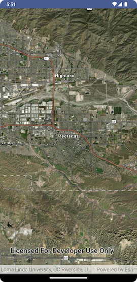
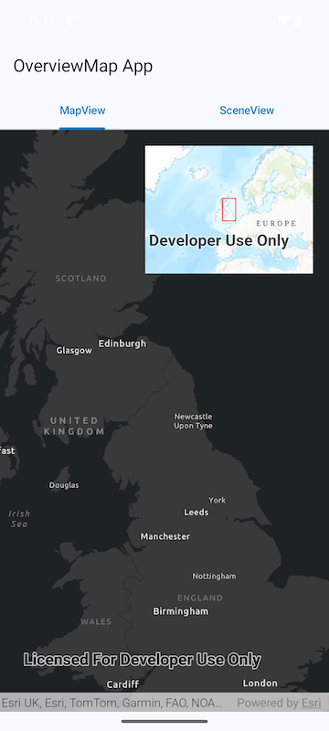
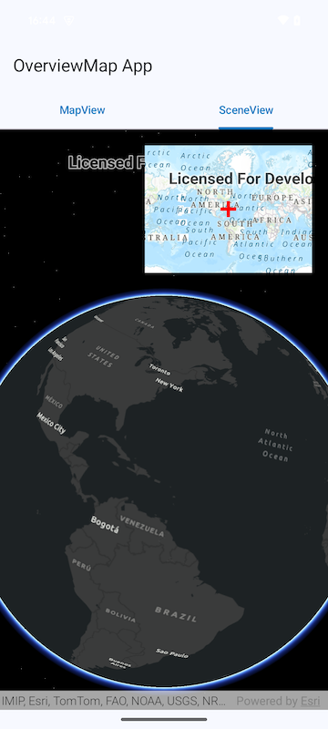

# GeoView-Compose

The GeoView-Compose module provides `@Composable` implementations of the `MapView` and `SceneView` with a Compose-idiomatic API.



*View the API Reference for the `geoview-compose` module [here](https://developers.arcgis.com/kotlin/toolkit-api-reference/arcgis-maps-kotlin-toolkit/com.arcgismaps.toolkit.geoviewcompose/index.html).*

## Features

### Display a Map

Displaying a map on the screen looks like this:

```kotlin
val arcGISMap = remember { ArcGISMap(BasemapStyle.ArcGISImagery) }
MapView(
	modifier = Modifier.fillMaxSize(),
	arcGISMap = arcGISMap
)
```

### Respond to User Input

The composable `MapView` and `SceneView` expose gesture events as lambda callback parameters:

```kotlin
val arcGISMap = remember { ArcGISMap(BasemapStyle.ArcGISImagery) }
MapView(
	modifier = Modifier.fillMaxSize(),
	arcGISMap = arcGISMap,
	onSingleTapConfirmed = { singleTapConfirmedEvent ->
		val x = singleTapConfirmedEvent.screenCoordinate.x
		val y = singleTapConfirmedEvent.screenCoordinate.y
		Log.i("MapView", "Single tap at $x, $y")
	}
)
```

### Set a Viewpoint

To set a viewpoint, create a `MapViewProxy` and call `setViewpoint()` on it after the `MapView` is displayed on screen:

```kotlin
val point = Point(-117.182541, 34.055569, SpatialReference.wgs84())
val scale = 170000.0
val mapViewProxy = remember { MapViewProxy() }

Button(
    onClick = {
        mapViewProxy.setViewpoint(point, scale)
    }
) {
    Text("Set Viewpoint")
}
MapView(
    modifier = Modifier.fillMaxSize(),
    arcGISMap = remember { ArcGISMap(BasemapStyle.ArcGISImagery) },
    mapViewProxy = mapViewProxy,
)
```

Note that the viewpoint of the MapView will automatically be persisted across configuration changes and process death. How this behaves can be customized by supplying the `viewpointPersistence` parameter to the `MapView`

```kotlin
MapView(
    modifier = Modifier.fillMaxSize(),
    arcGISMap = remember { ArcGISMap(BasemapStyle.ArcGISImagery) },
    viewpointPersistence = ViewpointPersistence.ByBoundingGeometry
)
```

Examples of how to use `MapViewpointOperation` and `SceneViewpointOperation` are available in the respective microapps:

- [MapView Set Viewpoint App](../../microapps/MapViewSetViewpointApp/README.md)
- [SceneView Set Viewpoint App](../../microapps/SceneViewSetViewpointApp/README.md)

### Display the Device Location

A `LocationDisplay` can be used to display the device's location as a blue dot on a `MapView`:

```kotlin
val arcGISMap = remember { ArcGISMap(BasemapStyle.ArcGISImagery) }
val scope = rememberCoroutineScope()
val locationDisplay = rememberLocationDisplay {
	start(scope)
}
MapView(
	modifier = Modifier.fillMaxSize(),
	arcGISMap = remember { ArcGISMap(BasemapStyle.ArcGISImagery) },
	locationDisplay = locationDisplay
)
```

An example of how to display the device location is available in the [MapView Location Display App](../../microapps/MapViewLocationDisplayApp/README.md).

### Identify a Feature

To identify a feature, create a `MapViewProxy` and call `identify()` on it after the `MapView` is displayed on screen

```kotlin
val mapViewProxy = remember { MapViewProxy() }
val arcGISMap = remember { ArcGISMap(BasemapStyle.ArcGISImagery) }
val scope = rememberCoroutineScope()
MapView(
	modifier = Modifier.fillMaxSize(),
	arcGISMap = arcGISMap,
	mapViewProxy = mapViewProxy,
	onSingleTapConfirmed = { singleTapConfirmedEvent ->
		scope.launch {
			mapViewProxy.identify(featureLayer, singleTapConfirmedEvent.screenCoordinate, 20.dp)
		}
	}
)
```

An example of how to identify features and graphics is available in the [MapView Identify App](../../microapps/MapViewIdentifyApp/README.md).

### Display a Callout

To display a Callout, use the `content` lambda parameter of the `MapView` or `SceneView` to call the [Callout](./src/main/java/com/arcgismaps/toolkit/geoviewcompose/GeoViewScope.kt#L120) composable function: 

```kotlin
MapView(
    modifier = Modifier.fillMaxSize(),
    arcGISMap = arcGISMapWithFeatureLayer,
    onSingleTapConfirmed = { identifyGeoElement(it) },
    content = {
        if (selectedGeoElement != null) {
            Callout(
                modifier = Modifier.wrapContentSize(),
                shapes = CalloutDefaults.shapes(
                    cornerRadius = 15.dp,
                    leaderSize = DpSize(width = 12.dp, height = 10.dp)
                ),
                colorScheme = CalloutDefaults.colors(
                    borderColor = MaterialTheme.colorScheme.outlineVariant,
                    backgroundColor = MaterialTheme.colorScheme.background
                )
                geoElement = selectedGeoElement,
                tapLocation = tapLocation
            ) {
                Column { // Callout content
                    Text(text = "Tapped Point: ${tapLocation.x},${tapLocation.y}")
                }
            }
        }
    }
)
```

An example of how to use the Callout on a point or geo-element is available in the [MapView Callout App](../../microapps/MapViewCalloutApp/README.md).

### Display an OverviewMap

The Overview Map is a small, secondary Map View (sometimes called an "inset map"), that can be
superimposed on an existing Map View or Scene View, which shows a representation of the main view's
current viewpoint.

 

#### Basic usage for displaying an Overview Map

A simple workflow is to display the Overview Map on top of a Map View and use the viewpoint and
visible area callbacks to update the overview.

There are two overloads of the Overview Map - one to use when creating an overview of a Map View and
the other to use when creating an overview of a Scene View.

Use the following code to create the UI for a Map View overview

```kotlin
val viewpoint: MutableState<Viewpoint?> = remember { mutableStateOf(null) }
val visibleArea: MutableState<Polygon?> = remember { mutableStateOf(null) }

Box {
    MapView(
        modifier = Modifier.fillMaxSize(),
        arcGISMap = remember {
            ArcGISMap(BasemapStyle.ArcGISDarkGray)
        },
        onViewpointChangedForCenterAndScale = {
            viewpoint.value = it
        },
        onVisibleAreaChanged = {
            visibleArea.value = it
        }
    )
    OverviewMap(
        viewpoint = viewpoint.value,
        visibleArea = visibleArea.value,
        modifier = Modifier
            .size(250.dp, 200.dp)
            .padding(20.dp)
            .align(Alignment.TopEnd)
    )
}
```

or, for a Scene View overview

```kotlin
val viewpoint: MutableState<Viewpoint?> = remember { mutableStateOf(null) }

Box {
    SceneView(
        modifier = Modifier.fillMaxSize(),
        arcGISScene = remember {
            ArcGISScene(BasemapStyle.ArcGISDarkGray)
        },
        onViewpointChangedForCenterAndScale = {
            viewpoint.value = it
        },
    )
    OverviewMap(
        viewpoint = viewpoint.value,
        modifier = Modifier
            .size(250.dp, 200.dp)
            .padding(20.dp)
            .align(Alignment.TopEnd)
    )
}
```

Note that the overloads for `OverviewMap` can take a `Symbol` that defines how the parent view's
visible map is symbolized in the overview. Any symbol provided must be suitable for a polygon
geometry if the overview is for a Map View and suitable for a point geometry if the overview is for
a Scene View.

#### Example

To see it in action, try out the [Overview Map micro-app](../../microapps/OverviewMapApp) and refer
to [MainScreen.kt](../../microapps/OverviewMapApp/app/src/main/java/com/arcgismaps/toolkit/overviewmapapp/screens/MainScreen.kt)
in the project.

### Other Examples:

Other microapps that demonstrate various workflows with the composable `MapView` and `SceneView` are available:

- [MapView Geometry Editor App](../../microapps/MapViewGeometryEditorApp/README.md) demonstrates the use of `GeometryEditor` and `GraphicsOverlay`
- [MapView Insets App](../../microapps/MapViewInsetsApp/README.md) demonstrates the use of `Insets`
- [SceneView Analysis Overlay App](../../microapps/SceneViewAnalysisOverlayApp/README.md) demonstrates the use of `AnalysisOverlay`
- [SceneView Camera Controller App](../../microapps/SceneViewCameraControllerApp/README.md) demonstrates the use of the `CameraController`
- [SceneView Lighting Options App](../../microapps/SceneViewLightingOptionsApp/README.md) demonstrates the use of various lighting options with the `SceneView`
- [MapView CalloutApp](../../microapps/MapViewCalloutApp/README.md) demonstrates the use of Callout with the `MapView`
- [SceneView CalloutApp](../../microapps/SceneViewCalloutApp/README.md) demonstrates the use of Callout with the `SceneView`


