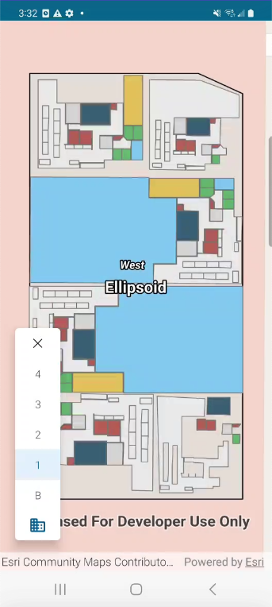

#  FloorFilter

The FloorFilter component simplifies visualization of GIS data for a specific floor of a building in your application. 
It allows you to filter down the floor aware data displayed in your GeoView to a site, a building in the site, or a floor
in the building. 

|FloorFilter|
|:--:|
||

##  Workflow

The simplest workflow is for the app to instantiate a `FloorFilter` using an instance of the `FloorFilterState` to ideally display it within the GeoView. The `Modifier` properties of `Box`,`Column` or `Row` could be used to position the `FloorFilter` inside of a Composable Map.

```kotlin
val mapViewModel = viewModel<MapViewModel>(factory = MapViewModelFactory(floorAwareWebMap))
ComposableMap(
     modifier = Modifier.fillMaxSize(),
     mapInterface = mapViewModel
 ) {
    Box(
        modifier = Modifier.fillMaxSize().padding(horizontal = 20.dp, vertical = 40.dp),
        contentAlignment = Alignment.BottomStart
    ) {
        FloorFilter(floorFilterState = mapViewModel.floorFilterState)
    }
}
```

Optionally, the default UI settings of the `FloorFilter` may be overridden by modifying `UIProperties` defined in the [FloorFilterState].
The `UIProperties` enable the customization of the colors, visibility, typography, and more.

```kotlin
// in the MapViewModel
private val uiProperties = UIProperties().apply {
    selectedForegroundColor = Color.Red
    typography = MaterialTheme.typography
    maxDisplayLevels = 2
    closeButtonPosition = ButtonPosition.Bottom
}
// create the floor filter state
val floorFilterState = FloorFilterState(geoModel, coroutineScope, uiProperties)
// pass the floor filter state in the compose layout
FloorFilter(floorFilterState = mapViewModel.floorFilterState)
```

To see the FloorFilter in action, try out the [floor-filter-app](../../microapps/FloorFilterApp) micro app.
../../toolkit/authentication/README.md
