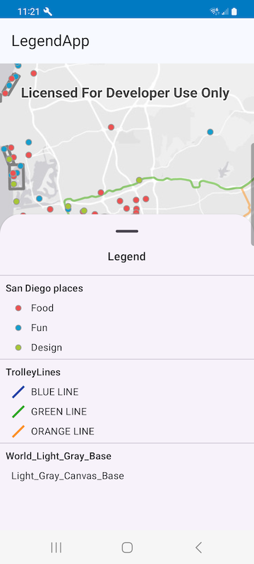

# Legend

## Description

The Legend visually explains the symbols used on a map. It shows the names of layers, sublayers and the legendInfo used in the map or scene. The legend will display the layer symbology and description so users can better understand what is being viewed in the map view or scene view. The Legend is dynamic and only contains information about visible layers. As layers go in and out of scale range, the legend updates to include only those layers that are visible to the user at that scale.



## Behavior

To see Legend in action, check out the [Legend microapp](../../microapps/LegendApp).

## Features

- Enables filtering out layers that are hidden because they are out of scale via the `respectScaleRange` property.
- Supports reversing the order of displayed layers via the `reverseLayerOrder` property.
- Supports customizing the title of the legend via the `title` property

## Get Started

The `Legend` can be rendered within a composition by simply calling the `Legend` composable function. The `Legend` should be displayed in a container.

 ```kotlin
 @Composable
fun MainScreen(viewModel: LegendViewModel = viewModel()) {

    val loadState by viewModel.arcGISMap.loadStatus.collectAsState()
    val basemap = viewModel.arcGISMap.basemap.collectAsState()
    var currentScale: Double by remember { mutableDoubleStateOf(Double.NaN) }
    ...

    BottomSheetScaffold(
        sheetContent = {
            AnimatedVisibility(
                visible = loadState is LoadStatus.Loaded,
                ...
            ) {
                Legend(
                    operationalLayers = viewModel.arcGISMap.operationalLayers,
                    basemap = basemap.value,
                    currentScale = currentScale,
                    modifier = Modifier.fillMaxSize()
                )
            }
        },
        ...
    ) { padding ->
        MapView(
            modifier = Modifier
                .padding(padding)
                .fillMaxSize(),
            arcGISMap = viewModel.arcGISMap,
            onViewpointChangedForCenterAndScale = {
                currentScale = it.targetScale
            }
        )
    }
}
 ```

More information on the material 3 specs [here](https://m3.material.io/components/text-fields/specs#e4964192-72ad-414f-85b4-4b4357abb83c)
