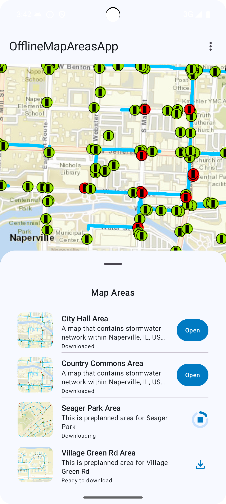
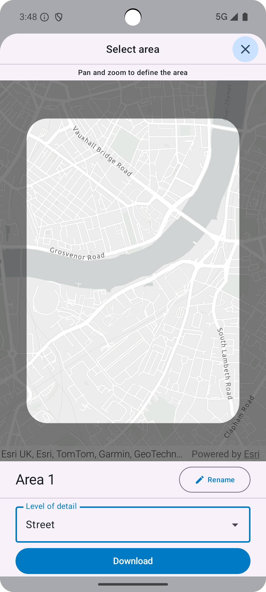

# OfflineMapAreas

The `OfflineMapAreas` toolkit component provides composable UI to take a web map offline by downloading map areas. 

Users can download map areas created ahead-of-time(preplanned) by the web map author, or they can create map areas on-demand by specifying an area of interest and level of detail. Map areas are downloaded to the app’s external directory and can be used when the device is disconnected from the network. Users can get information about a map area such as its size and the geographic region it covers. They can also delete a downloaded map area to free up storage space on the device.


| Ahead-of-time (preplanned) workflow 	| On-demand workflow 	|
|:---:	|:---:	|
|  	|  	|

## Features

Supports both ahead-of-time (preplanned) and on-demand map areas for an offline enabled web map. This `OfflineMapAreas` composable:

- Displays a list of map areas.
- Shows download progress and status for map areas.
- Opens a map area for viewing when selected.
- Provides options to view details about downloaded map areas.
- Supports removing downloaded offline map areas files from the device.

For preplanned workflows, this composable:
- Displays a list of available preplanned map areas from an offline-enabled web map that contains preplanned map areas when the network is connected.
- Downloads preplanned map areas in the list.
- Displays a list of downloaded preplanned map areas on the device when the network is disconnected.

For on-demand workflows, this composable:
- Allows users to add and download on-demand map areas to the device by specifying an area of interest and level of detail.
- Displays a list of on-demand map areas available on the device that are tied to a specific web map.

## Usage

To use the composable you would need to provide an `OfflineMapState`. The state object provides two constructors to initialize the `OfflineMapAreas` composable using an `ArcGISMap` or an `OfflineMapInfo`. Therefore, the composable can be used either when the device is connected to or disconnected from the network.

- Online WorkFlow (Device is connected to the network)
  - Displays preplanned map areas from a web map that are available for download.
  - When the web map doesn’t contain preplanned map areas, users can add and download on-demand map areas by specifying a geographic area and level of detail.
  - Use the constructor with `ArcGISMap` to create the state.
- Offline WorkFlow (Device is disconnected from the network)
  - Displays only downloaded map areas by retrieving offline map info from the device.
  - Use the constructor with `OfflineMapInfo` to create the state. `OfflineRepository.OfflineMapInfos` provides the list of all portal item information for web maps that have downloaded map areas can be obtained using the `OfflineRepository` singleton object. 
- When the device network connection has changed…
  - Re-initialize the `OfflineMapState` using the desired constructor.

### Permissions 

The `OfflineMapAreas` toolkit component requires the following app-level permissions to function correctly. These permissions should be added to the `AndroidManifest.xml` of the app and the calling app should request these permissions at runtime. If the permissions are not granted, the respective functionality will be limited:

- `android.permission.FOREGROUND_SERVICE_DATA_SYNC`: This permission is needed to enable the  component to perform data synchronization operations, such as downloading large map areas, as a foreground service, ensuring these downloads continue even if app is backgrounded or closed.

- `android.permission.INTERNET`: This permission is needed as the component would connect to the network to display available preplanned map areas from a web map and to download both preplanned and on-demand map areas.

- `android.permission.POST_NOTIFICATIONS`: This permission is essential for enabling the component to display notifications. It allows the component to communicate the progress and status of map area downloads, as well as to notify users upon the completion of a download.

## Workflow example:
```kotlin
val selectedMap = mutableStateOf<ArcGISMap?>(null)

val displayedMap get() = selectedMap.value ?: onlineMap

val offlineMapState = OfflineMapState(
    arcGISMap = displayedMap,
    onSelectionChanged = { offlineMap ->
        selectedMap.value = offlineMap
    }
)

@Composable
fun SheetContent() {
    OfflineMapAreas(
        offlineMapState = offlineMapState,
        modifier = Modifier
            .padding(horizontal = 16.dp)
            .animateContentSize()
    )
}
```

To see OfflineMapAreas in action, check out the [OfflineMapAreas microapp](../../microapps/OfflineMapAreasApp).
