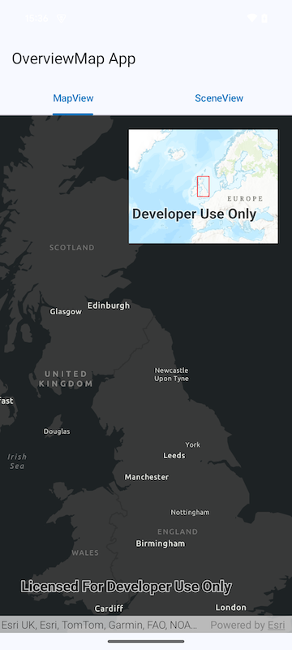
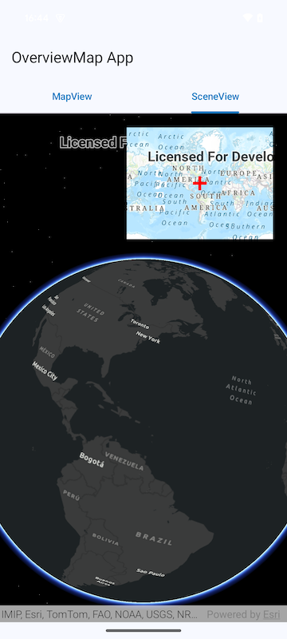

# OverviewMap

The Overview Map displays...

 

### Basic usage for displaying an Overview Map

A simple workflow is to display the Overview Map on top of a Map View and use the viewpoint and
visible area callbacks to update the overview.

Use the following code to create the UI

```kotlin
val viewpoint: MutableState<Viewpoint?> = remember { mutableStateOf(null) }
val visibleArea: MutableState<Polygon?> = remember { mutableStateOf(null) }

Box {
    MapView(
        modifier = Modifier.fillMaxSize(),
        arcGISMap = remember {
            ArcGISMap(BasemapStyle.ArcGISDarkGray)
        },
        onViewpointChangedForCenterAndScale = {
            viewpoint.value = it
        },
        onVisibleAreaChanged = {
            visibleArea.value = it
        }
    )
    OverviewMap(
        viewpoint = viewpoint.value,
        visibleArea = visibleArea.value,
        modifier = Modifier
            .size(250.dp, 200.dp)
            .padding(20.dp)
            .align(Alignment.TopEnd)
    )
}
```

or, for a Scene View

```kotlin
val viewpoint: MutableState<Viewpoint?> = remember { mutableStateOf(null) }
val visibleArea: MutableState<Polygon?> = remember { mutableStateOf(null) }

Box {
    SceneView(
        modifier = Modifier.fillMaxSize(),
        arcGISScene = remember {
            ArcGISScene(BasemapStyle.ArcGISDarkGray)
        },
        onViewpointChangedForCenterAndScale = {
            viewpoint.value = it
        },
    )
    OverviewMap(
        viewpoint = viewpoint.value,
        modifier = Modifier
            .size(250.dp, 200.dp)
            .padding(20.dp)
            .align(Alignment.TopEnd)
    )
}
```

## Example

To see it in action, try out the [Overview Map micro-app](../../microapps/OverviewMapApp) and refer
to [MainScreen.kt](../../microapps/OverviewMapApp/app/src/main/java/com/arcgismaps/toolkit/overviewmapapp/screens/MainScreen.kt)
in the project.