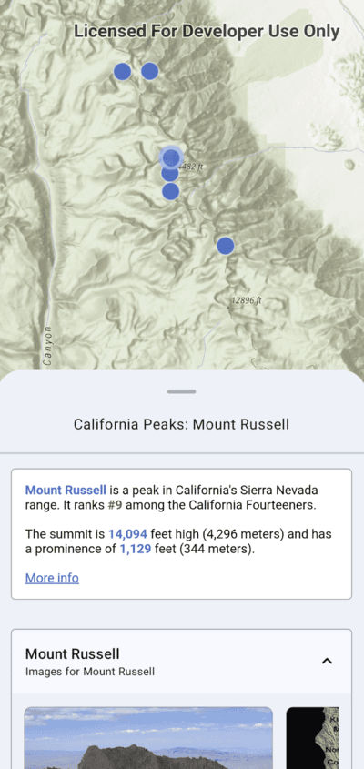

# Popup

## Description

The Popup toolkit component enables users to view field values of features in a layer using the `Popup` API that has been configured externally (using either in the Web Map Viewer or the Fields Maps web app).



## Behavior

To see it in action, check out the [microapp](../../microapps/PopupApp).

## Features

The `Popup` is a composable function that can render a [Popup object](https://developers.arcgis.com/kotlin/api-reference/arcgis-maps-kotlin/com.arcgismaps.mapping.popup/-popup/index.html) using Jetpack Compose.
- It can be integrated into any custom layout or container. The [microapp](../../microapps/PopupApp) integrates it into a `BottomSheet`.
- It follows the material 3 design system.

## Get Started

To get started, set up a `composable MapView` as described [here](../geoview-compose/README.md)

Get Popup objects from tapping on [GeoElements](https://developers.arcgis.com/kotlin/api-reference/arcgis-maps-kotlin/com.arcgismaps.mapping/-geo-element/index.html) on the composable MapView as follows:

```kotlin
// set up some variables
val mapViewProxy = rememeber { MapViewProxy() }
val scope = rememberCoroutineScope()
var popup: Popup? by remember { mutableStateOf(null) }

// a public webmap with Popups defined
val portalItem = PortalItem(
    Portal.arcGISOnline(Portal.Connection.Anonymous),
    "9f3a674e998f461580006e626611f9ad"
)
val arcGISMap = remember { ArcGISMap(portalItem) }

// call the composable MapView
MapView(
    arcGISMap = arcGISMap,
    mapViewProxy = proxy,
    onSingleTapConfirmed = {
        scope.launch {
            proxy.identifyLayers(
                screenCoordinate = it.screenCoordinate,
                tolerance = 22.dp,
                returnPopupsOnly = true
            ).onSuccess { results ->
                if (results.isEmpty()) {
                    withContext(Dispatchers.Main) {
                        Toast.makeText(
                            context,
                            "Tap did not identify any Popups",
                            Toast.LENGTH_LONG
                        ).show()
                    }
                } else {
                    popup = results[0]?.popups?.first
                }
            }
        }
    }
)
```

**Note:** 
- For API level 28 and below, you must include WRITE_EXTERNAL_STORAGE permission in your `AndroidManifest.xml` to enable saving media to device storage.

#### Rendering the composable Popup function

A `Popup` can be rendered within a composition by simply calling the `Popup` composable with a [Popup object](https://developers.arcgis.com/kotlin/api-reference/arcgis-maps-kotlin/com.arcgismaps.mapping.popup/-popup/index.html). The Popup should be displayed in a container. Its visibility and the container are external and should be controlled by the calling Composable.

```kotlin  
@Composable  
fun MyComposable(popup : Popup) {  
    // a container  
    MyContainer(modifier = Modifier) {
    	// create a Popup Composable
        Popup(  
	        // pass in the Popup object  
	        popup = Popup,  
	        // control the layout using the modifier property  
	        modifier = Modifier.fillMaxSize()  
	    )  
    }  
} 
```  

#### Updating the `Popup`

To display a new `Popup` object, simply trigger a recomposition with the new `Popup` object.

```kotlin  
@Composable  
fun MyComposable(viewModel : MyViewModel) {  
    // use a state object that will recompose this composable when the Popup changes
    // in this example, the Popup object is hoisted in the ViewModel
    val Popup : State by viewModel.Popup  
    // a container  
    MyContainer(modifier = Modifier) {
        Popup(    
	        popup = Popup,  
	        modifier = Modifier.fillMaxSize()  
	    )  
    }  
}
```  

More information on the material 3 specs [here](https://m3.material.io/components/text-fields/specs#e4964192-72ad-414f-85b4-4b4357abb83c)
