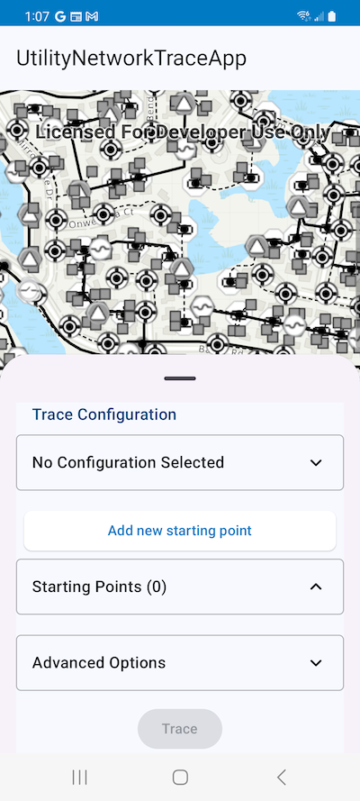

# UtilityNetworks

## Description

The UtilityNetworks toolkit component provides composable UI components for interacting with [UtilityNetworks](https://developers.arcgis.com/kotlin/api-reference/arcgis-maps-kotlin/com.arcgismaps.utilitynetworks/-utility-network/index.html?query=class%20UtilityNetwork).




## Behavior

To see UtilityNetworkTraces in action, check out the [UtilityNetworkTrace microapp](../../microapps/UtilityNetworkTraceApp).

## Features

The `Trace` function is a composable function that provides configuration of networks traces and selects the Features that participate in the trace on a composable MapView.
- It can be integrated into any custom layout or container. The [microapp](../../microapps/UtilityNetworkTraceApp) integrates it into a `BottomSheet`.
- It follows the material 3 design system.

## Get Started

To get started, set up a `composable MapView` as described [here](../geoview-compose/README.md).

Ensure the MapView's [ArcGISMap](https://developers.arcgis.com/kotlin/api-reference/arcgis-maps-kotlin/com.arcgismaps.mapping/-arc-g-i-s-map/index.html?query=class%20ArcGISMap) has at least one UtilityNetwork in its definition.


#### Setting up the `UtilityNetwork`

To display an ArcGISMap containing a UtilityNetwork, create a new `TraceState` object.

```kotlin  
  // In this example, the ArcGISMap object and the TraceState object are hoisted in the ViewModel
  class MyComposablesViewModel : ViewModel() {
    val arcGISMap = ArcGISMap(
        PortalItem(
            Portal.arcGISOnline(connection = Portal.Connection.Anonymous),
            "471eb0bf37074b1fbb972b1da70fb310"
        )
    )

    val mapViewProxy = MapViewProxy()

    val graphicsOverlay = GraphicsOverlay()

    val traceState = TraceState(arcGISMap, graphicsOverlay, mapViewProxy)

    init {
        viewModelScope.launch {
            arcGISMap.load()
        }
    }
}
```  

#### Rendering the composable Trace function

The `Trace tool` can be rendered within a composition by simply calling the `Trace` composable function). The Trace should be displayed in a container. Its visibility and the container are external and should be controlled by the calling Composable.

```kotlin
import com.arcgismaps.toolkit.utilitynetworks.TraceState
import com.arcgismaps.toolkit.utilitynetwork.Trace

@Composable  
fun MyComposable(traceState : TraceState) {  
    
    BottomSheetScaffold(
        sheetContent = {
            AnimatedVisibility(
                ...
                label = "trace tool",
                modifier = Modifier.heightIn(min = 0.dp, max = 350.dp)
            ) {
                Trace(traceState = viewModel.traceState)
            }
        }
        ...
    ) { 
        MapView(
            arcGISMap = viewModel.arcGISMap,
            mapViewProxy = viewModel.mapViewProxy,
            graphicsOverlays = listOf(viewModel.graphicsOverlay),
            ...
        )
       ... 
} 
```  

More information on the material 3 specs [here](https://m3.material.io/components/text-fields/specs#e4964192-72ad-414f-85b4-4b4357abb83c)
